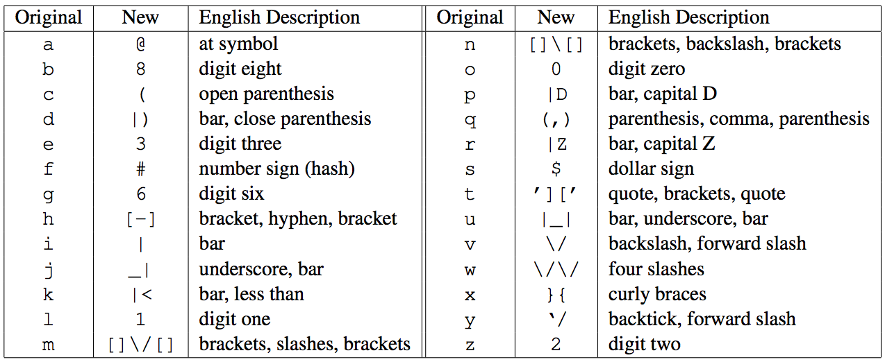

## 문제

A New Alphabet has been developed for Internet communications. While the glyphs of the new alphabet don’t necessarily improve communications in any meaningful way, they certainly make us feel cooler.

You are tasked with creating a translation program to speed up the switch to our more elite New Alphabet by automatically translating ASCII plaintext symbols to our new symbol set.

The new alphabet is a one-to-many translation (one character of the English alphabet translates to anywhere between 1 and 6 other characters), with each character translation as follows:

For instance, translating the string “Hello World!” would result in:

[-]3110 \/\/0|Z1|)!

Note that uppercase and lowercase letters are both converted, and any other characters remain the same (the exclamation point and space in this example).

## 입력

Input contains one line of text, terminated by a newline. The text may contain any characters in the ASCII range 32–126 (space through tilde), as well as 9 (tab). Only characters listed in the above table (A–Z, a–z) should be translated; any non-alphabet characters should be printed (and not modified). Input has at most 10 000 characters.

## 출력

Output the input text with each letter (lowercase and uppercase) translated into its New Alphabet counterpart.
