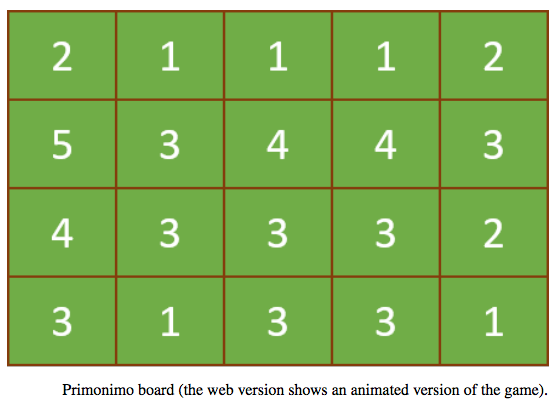

## 문제

Primonimo is a game played on an n × m board filled with numbers taken from the range 1 . . . p for some prime number p. At each move, a player selects a square and adds 1 to the numbers in all squares in the same row and column as the selected square. If a square already shows the number p, it wraps around to 1.

The game is won if all squares show p. Given an initial board, find a sequence of moves that wins the game!

## 입력

The input consists of a single test case. The first line contains three numbers n m p denoting the number of rows n (1 ≤ n ≤ 20), the number of columns m (1 ≤ m ≤ 20), and a prime number p (2 ≤ p ≤ 97). Each of the next n lines consists of m numbers in the range 1 . . . p.

## 출력

If a winning sequence of at most p · m · n moves exists, output an integer k ≤ p · m · n denoting the number of moves in the sequence. Then output k moves as a sequence of integers that numbers the board in row-major order, starting with 1. If there are multiple such sequences, you may output any one of them. If no winning sequence exists, output -1.
