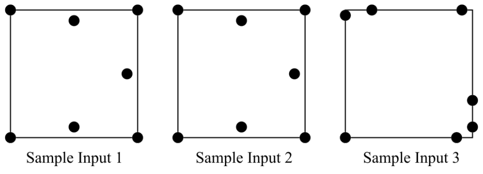

## 문제

In the game of Unusual Darts, Alice throws seven darts onto a 2-foot by 2-foot board, and then Bob may or may not throw three darts.

Alice’s seven darts define a polygon by the order in which they are thrown, with the perimeter of the polygon connecting Dart 1 to Dart 2 to Dart 3 to Dart 4 to Dart 5 to Dart 6 to Dart 7, and back to Dart 1. If the polygon so defined is not simple (meaning it intersects itself) then Alice loses. If the polygon is simple, then Bob throws three darts. He is not a very good player, so although his darts always land on the board, they land randomly on the dart board following a uniform distribution. If all three of these darts land within the interior of the polygon, Bob wins, otherwise Alice wins.

For this problem you are given the locations of Alice’s darts (which form a simple polygon) and the probability that Bob wins. Your job is to determine the order in which Alice threw her darts.

## 입력

The first line of input contains an integer N (1 ≤ N ≤ 1 000), indicating the number of Darts games that follow. Each game description has 8 lines. Lines 1 through 7 each have a pair of real numbers with 3 digits after the decimal point. These indicate the x and y coordinates of Alice’s seven darts (x1 y1 to x7 y7), which are all at distinct locations. All coordinates are given in feet, in the range (0 ≤ xi, yi ≤ 2). The 8th line contains a real number p with 5 digits after the decimal point, giving the probability that Bob wins. In all test cases, Alice’s darts do form a simple polygon, but not necessarily in the order given.

## 출력

For each Darts game, output the order in which the darts could have been thrown, relative to the order they were given in the input, so that Bob wins with probability p. If several answers are possible, give the one that is lexicographically least. Any ordering that would give Bob a probability of winning within 10−5 of the given value of p is considered a valid ordering.
