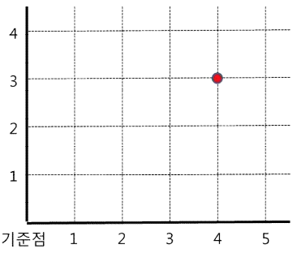
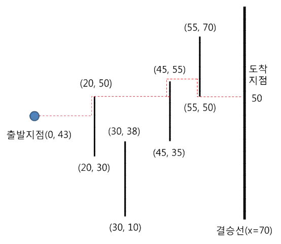
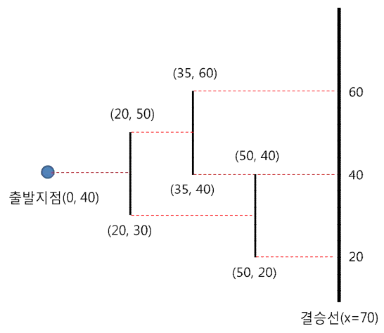

## 문제

평면 상에서 어떤 점의 위치를 나타내기 위해 좌표를 이용하면 매우 편리하다. <그림 1>에서 예로 보인 것처럼 기준점(이를 원점이라 부른다)에서 우측으로 거리가 4, 위로 거리가 3에 놓인 빨간 점의 좌표는 (4, 3)로 표시한다. 좌표를 이용하면 평면 상에 있는 어떤 점의 위치도 쉽게 나타낼 수 있다. 즉, 기준점에서 오른쪽으로 거리가 x, 위로 거리가 y에 놓인 점의 좌표는 (x, y)로 나타낸다. 기준점(원점)의 좌표는 (0, 0)이 된다.

<그림 1>

장애물이 설치된 넓은 들판에서 재미있는 달리기 시합이 벌어진다. 들판 곳곳에 수직방향(남북방향)으로 된 담장 모양의 장애물이 설치되어 있다. 선수는 출발지점에서 동쪽방향으로 달리기 시작하다가 장애물을 만나면 남쪽 또는 북쪽으로 달려 장애물을 피해가야 한다. 장애물 끝에 다다르면 다시 선수는 동쪽으로만 달릴 수 있다.

이 달리기의 목표는 결승선으로 지정된 (무한히 긴) 수직선에 가장 짧은 거리를 달려 도달하는 것이다. 달리기 시작 전에 모든 장애물에 대한 정보가 선수에게 주어진다. 즉, 어떤 크기의 장애물이 어느 위치에 놓여있는지에 대한 정보가 선수에게 주어지고, 선수는 장애물을 피해가면서 가장 짧은 거리를 달려 결승선에 도착해야 한다.

선수의 출발지점 및 각 장애물 양 끝점의 위치는 (x, y) 좌표를 사용하여 표시한다. 모든 좌표 값은 정수로 주어지고, 출발지점의 x 좌표는 0이다. 각 장애물은 수직선분으로 볼 수 있고, 이때 양 끝점의 x 좌표는 동일하기 때문에 장애물에 대한 정보는 세 값 [x, yl, yh] (yl < yh)으로 나타낼 수 있다. 이 세 값은 장애물이 설치된 곳의 x 좌표와 양 끝점의 y 좌표를 나타낸다.

x 좌표가 동일한 두 장애물이 겹치거나 또는 한 점에서 만나는 경우는 없다.

선수가 동쪽으로 달리다가 장애물의 끝 점을 만나면 계속 동쪽으로 달려간다.

<그림 2>의 예를 보자. 출발지점이 (0, 43), 결승선의 x 좌표가 70이고, 4개의 수직 장애물에 대한 정보가 각각 [20, 30, 50], [30, 10, 38], [45, 35, 55], [55, 50, 70]인 경우, 최단의 이동경로는 점선으로 표시한 것처럼 (0, 43) → (20, 43) → (20, 50) → (45, 50) → (45, 55) → (55, 55) → (55, 50) → (70, 50)이 되고, 이때의 총 이동거리는 87이다. 또한 도착지 점의 y 좌표는 50이 된다.

<그림 2>

<그림 3>의 예에선 서로 다른 최단경로가 다음과 같이 4개가 있다

1. (0, 40) → (20, 40) → (20, 50) → (35, 50) → (35, 60) → (70, 60)
2. (0, 40) → (20, 40) → (20, 50) → (35, 50) → (35, 40) → (70, 40)
3. (0, 40) → (20, 40) → (20, 30) → (50, 30) → (50, 40) → (70, 40)
4. (0, 40) → (20, 40) → (20, 30) → (50, 30) → (50, 20) → (70, 20)

<그림 3>

<그림 3>에서 보인 경로 가운데 경로 ②와 경로 ③은 달리는 경로는 다르지만 도착지점은 동일하다.

출발지점의 y 좌표, 결승선의 x 좌표, N개의 장애물에 대한 정보가 주어질 때 이동 규칙을 따르는 최단경로를 모두 찾은 후, 도착지점이 서로 다른 최단경로의 도착지점의 y 좌표 값을 오름차순으로 차례로 출력하는 프로그램을 작성하시오.

## 입력

표준 입력으로 다음 정보가 주어진다. 첫 번째 줄에는 장애물의 개수를 나타내는 정수 N (1 ≤ N ≤ 100,000)이 주어진다. 다음 줄에는 출발지점의 y 좌표와 결승선의 x 좌표를 나타내는 두 정수가 차례로 주어진다. 이어지는 N 개의 줄 각각엔 장애물의 정보를 나타내는 세 정수 [x, yl, yh] (yl < yh)가 차례로 주어진다. 문제에서 사용되는 모든 좌표 (x, y)에 대해, 0 ≤ x ≤ 1,000,000이고 0 ≤ y ≤ 2,000,000이다. 모든 장애물의 x 좌표는 0보다 크고 결승선의 x 좌표보다 작다.

## 출력

표준 출력으로 첫 번째 줄에는 최단경로의 길이를 출력한다. 두 번째 줄엔 최단경로들의 서로 다른 도착지점의 개수 k와, k개의 도착지점의 y 좌표를 오름차순으로 차례로 출력한다.
