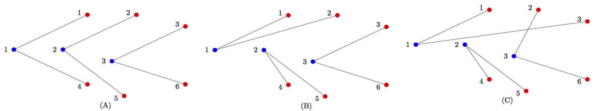

## 문제

정밀 측정 업체인 KOI회사는 레이저를 이용하여 멀리 떨어진 물체의 변화를 측정할 수 있는 장치를 여러 대 구입하여 서로 다른 장소에 설치하였다. 각 측정 장치는 두 개의 레이저 센서로 구성되어 있고 각 레이저 센서가 하나의 물체를 측정할 수 있어서, 측정 장치 하나가 두 개의 물체를 동시에 측정할 수 있다. 다만, 서로 다른 두 측정 장치에서 발사된 레이저 빛이 만날 경우 서로 간섭을 일으켜 측정 오류를 만들 수 있기 때문에, 레이저 빛들이 서로 교차하지 않도록 구성하려고 한다.

설치된 각 측정 장치의 위치를 2차원 평면위의 파란점으로 표시하고 측정할 물체의 위치를 빨간점으로 표시한다면, 다음과 같이 문제를 정의할 수 있다.

2차원 평면에 파란점 N개와 빨간점 2N개가 주어질 때, 아래의 조건을 모두 만족하는 연결 구성을 구하시오.

* 각 파란점은 두 개의 빨간점들과 선분으로 연결된다.
* 각 빨간점은 하나의 파란점과 선분으로 연결된다.
* 파란점과 빨간점을 연결하는 선분들은 서로 교차하지 않는다.

예를 들어, 다음 그림의 (A)에서 보는 바와 같이 파란점 3개가 주어지고 빨간점 6개가 주어졌을 때, 1번 파란점은 빨간점 1번과 4번에, 2번 파란점은 빨간점 2번과 5번에, 3번 파란점은 빨간점 3번과 6번에 각각 연결하여, 연결하는 선분들이 서로 교차하지 않는다. 따라서 그림의 (A) 연결 구성은 문제의 조건을 만족하는 구성이다. 그림의 (B)는 동일한 점집합에 대해 문제의 조건을 만족하는 다른 연결 구성을 보여준다. 즉, 같은 입력 점집합에 대해 문제의 조건을 만족하는 연결 구성이 여러 개 존재할 수 있다. 그림의 (C)에는 파란점 1과 빨간점 3을 연결하는 선분이 파란점 3과 빨간점 2를 연결하는 선분과 교차한다. 따라서, 문제의 조건을 만족하지 않는 연결 구성이다.

문제의 조건을 만족하는 점들의 연결 구성이 존재하는지 판별하여, 존재할 경우 그러한 연결 구성을 하나 구하여 그 구성을 이루는 파란점과 빨간점의 연결을 출력하시오.

## 입력

표준 입력으로 다음 정보가 주어진다. 첫 번째 줄에는 파란점의 수 N (1 ≤ N ≤ 1,000)이 주어진다. 그리고 그 다음 줄부터 N개의 줄에서 i번째 줄에는 i번째 파란점의 x좌표와 y좌표가 주어진다(1 ≤ i ≤ N). 그 다음 줄부터 2N개의 줄에서 i번째 줄에는 j번째 빨간점의 x좌표와 y좌표가 주어진다(1 ≤ j ≤ 2N). 각 좌푯값은 -108 이상 108 이하이다. 입력으로 주어지는 어떤 세 점도 일직선 위에 있지 않다.

## 출력

문제의 조건을 만족하는 연결 구성이 있을 경우 표준 출력의 i번째 줄에는 i번째 파란점과 연결된 두 개의 빨간점의 번호를 출력한다. 예를 들어, i번째 파란점이 j번째 빨간점과 k번째 빨간점에 연결되었다면, i번째 줄에는 “j k” 혹은 “k j” 를 출력한다. 문제의 조건을 만족하는 연결 구성이 없을 경우에는 표준 출력의 첫 번째 줄에 -1을 출력한다.
