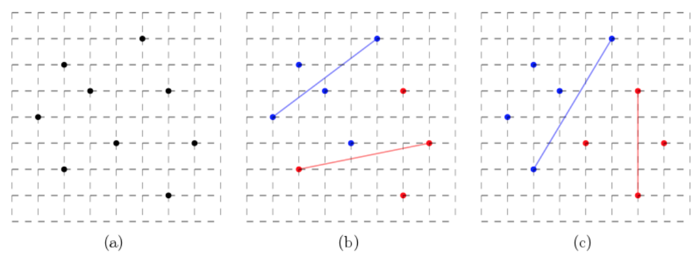

## 문제

A new city has many buildings. For an efficiency of administration, the city wants to split the buildings into two groups, red and blue ones. A diameter of a group is defined as the maximum distance of two buildings in the group, which is an important criterion to measure the geometric extent of the group. The smaller the diameter is, the easier the administration is made. The final goal of this work is to determine a partition such that the sum of the diameters of the two groups is minimized.

More precisely, a building is mapped to a point in the plane. The distance between two points is the Euclidean distance between them. Note that the diameter of a point set is the maximum distance of two points in the set. Given a set P of n distinct points in the plane, you partition P into two subsets P1 and P2 such that P1 ≠ ∅, P2 ≠ ∅, P1 ∪ P2 = P, P1 ∩ P2 = ∅, and the sum of the diameters of P1 and P2 is minimized. If a subset consists of only one point, then its diameter is zero. You write a program to compute the minimum diameter sum for P.

For example, nine points with integer coordinates are given in the plane as in Figure 1(a). There are many redblue partitions. If you partition the points as in Figure 1(b), then the diameter of the blue points is \(\sqrt{4^2+3^2} = 5\), and the diameter of the red points is \(\sqrt{5^2+1^2} = \sqrt{26}\), thus their sum is \(5 + \sqrt{26}\). The partition in Figure 1(c) has the sum of the diameters of \(4 + \sqrt{34}\), which is a bit smaller than the sum in Figure 1(b).

Figure 1. (a) Input points. (b), (c) Two red-blue partitions where the point pair determining the diameter of each group is marked with a line segment with same color of the group.

## 입력

Your program is to read from standard input. The input starts with a line containing an integer, n (2 ≤ n ≤ 5,000), where n is the number of points. In the following n lines, each of the n points in P is given line by line. Each point is represented by two numbers separated by a single space, which are the x-coordinate and the y-coordinate of the point, respectively. The coordinate is an integer between 0 and 10,000, inclusively.

## 출력

Your program is to write to standard output. Print exactly one line for the input. The line should contain the minimum diameter sum. The output is judged as a correct answer if it is within an absolute error of 10−3.
