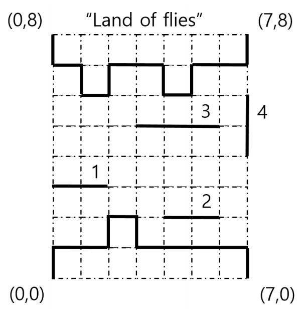

## 문제

어느 덥고 건조한 여름, 배고픈 개구리들이 물과 양식이 풍부한 “파리 나라(the land of flies)”를 향해 여행하고 있다. 여행하는 중 강을 건널 일이 생겼다. 보통의 경우 개구리들은 수영을 잘하지만, 너무 배고프고 피곤한 나머지 개구리는 걷기와 점프만 가능하다. 강 위에 통나무들이 떠다니고 있고, 개구리는 a) 통나무 위에서 걸어 다니거나, b) 한 통나무에서 다른 통나무로 점프할 수 있다. 개구리들은 너무 피곤하고 배고파서, 가능한 한 에너지를 적게 쓰고 싶다. 걸어 다닐 때는 거의 에너지를 쓰지 않기 때문에 걷는 거리는 신경 쓰지 않아도 된다. 반면, 개구리가 거리 x만큼 점프하면, x2 단위의 에너지를 쓰게 된다. 파리 나라에 도착하는 과정에서 사용된 에너지는 최소화되어야 한다.

다음 예제를 생각해보자. 강과 양쪽 강가는 8 × 9 크기의 격자로 표현할 수 있다. 처음 개구리는 아래쪽 강가에 있고, 파리 나라는 위쪽 강가에 있다. (a, b) − (c, d)는 양 끝점이 (a, b)와 (c, d)인 선분을 의미한다. 아래쪽 강가는 다음과 같은 7 개의 선분으로 표현할 수 있다. (0,0) − (0,1),(0,1) − (2,1), (2, 1) − (2,2) , (2,2) − (3, 2) , (3, 2) − (3,1) , (3,1) − (7,1) , (7,1) − (7,0) . 위쪽 강가는 다음과 같은 11 개의 선분으로 표현할 수 있다. (0, 8) − (0,7),(0, 7) − (1,7), (1,7) − (1,6), (1,6) − (2,6), (2,6) − (2,7), (2,7) − (4,7), (4,7) − (4,6), (4,6) − (5,6), (5,6) − (5,7), (5,7) − (7,7), (7,7) − (7,8). 강 위에는 4 개의 통나무가 있다. (0, 3) − (2, 3) , (6, 2) − (4, 2) , (3, 5) − (6, 5) , (7, 4) − (7, 6) . 모든 선분은 (강가이든, 통나무이든) x-축 또는 y-축에 평행하다고 가정하자. 또한 어떤 한 쌍의 통나무도 공통인 영역을 갖지 않고, 통나무와 강가도 공통인 영역을 갖지 않는다. 다시 한번 강조하지만, 개구리는 같은 선분 위라면 어느 위치로든지 에너지를 사용하지 않고 움직일 수 있다. 일단 파리 나라에 개구리가 도착하면 여행은 끝난다.

그림 1. 강 위의 네 통나무.

위 예에서, 개구리가 최대로 점프할 수 있는 거리가 \(\sqrt{5}\)라고 하자. 파리 나라로 도달하는 한 가지 경로는 먼저 통나무 1로 점프한 다음, 통나무 3으로 점프하고, 마지막으로 파리 나라로 점프하는 것이다. 이때 사용된 에너지의 총합은 \(1^2+\sqrt{5}^2 + 1^2 = 7\)이며, 이것이 최적이라는 것을 어렵지 않게 보일 수 있다. 만약 개구리가 최대로 점프할 수 있는 거리가 2라면, 파리 나라에 도달할 수 없음을 쉽게 보일 수 있다.

개구리가 강을 건너기 위해 필요한 최소 에너지를 계산하는 프로그램을 작성하시오.

## 입력

여러분의 프로그램은 표준 입력에서 입력을 받아야 한다. 입력은 여러 줄로 이루어져 있다. 첫 줄에는 두 정수 n과 m이 주어지는데, 이는 격자의 크기 n × m (3 ≤ n, m ≤ 5,000)을 나타낸다. 다음 줄에는 네 정수 u, v, w, l (2 ≤ u, v, w ≤ 2 ∗ max(n, m) , 1 ≤ l ≤ min((n − 1)2, (m − 1)2)) 이 주어진다. 아래쪽 강가에는 u개의 꼭짓점이 있고, 위쪽 강가에는 v개의 꼭짓점이 있으며, 강에는 w개의 통나무가 떠있다. 개구리가 최대로 점프할 수 있는 거리는 √l이다. 다음에 오는 u 줄 각각에는 두 정수 x와 y (0 ≤ x < n, 0 ≤ y < m)가 주어지는데, 이는 아래쪽 강가의 한 꼭짓점 (x, y)를 나타낸다. 이 꼭짓점들은 시계방향 순서대로 주어지며, 가장 아래이면서 가장 왼쪽에 오는 꼭짓점이 맨 처음 주어진다. 다음에 오는 v 줄 각각에는 두 정수 x 와 y (0 ≤ x < n, 0 ≤ y < m)가 주어지는데, 이는 위쪽 강가의 한 꼭짓점 (x, y)를 나타낸다. 이 꼭짓점들은 반시계방향 순서대로 주어지며, 가장 위이면서 가장 왼쪽에 오는 꼭짓점이 맨 처음 주어진다. 이웃하는 두 꼭짓점을 이은 선분은 반드시 x-축에 평행이거나 y-축에 평행이다. 마지막 w 줄 각각에는 네 정수 x1, y1, x2, y2 (0 ≤ x1, x2 < n, 0 ≤ y1, y2 < m)가 주어지는데, 이는 선분 (x1, y1) − (x2, y2)로 표현되는 통나무 하나를 표현한다. 반드시 x1 = x2이거나 y1 = y2이다. 아래쪽 강가와 위쪽 강가가 교차하지 않는다는 것은 보장된다.

## 출력

여러분의 프로그램은 표준 출력으로 출력해야 한다. 각 입력에 대해서 정확히 한 줄을 출력한다. 이 줄에는 개구리가 강을 건너가는데 필요한 에너지의 최솟값을 출력한다. 만약 개구리가 강을 건너갈 수 없다면, -1 을 출력한다.
