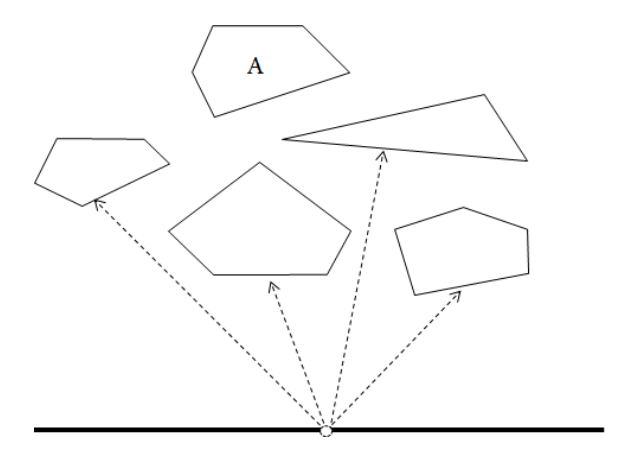

## 문제

NSC(Naro Space Center) has just discovered that n large meteorites are falling to Korea. NSC is plannning to blow up the meteorites using laserguided missile system. In order not to miss a single meteorite, NSC needs to identify the meteorites which are completely blocked by others at a specific moment. We call them invisible meteorites.

Each meteorite is represented by a convex polygon. All meteorites are seperated from each other, i.e., any two convex polygons do not intersect each other. The figure below shows an example of a situation with 5 meteorites and a laser-guided missile launcher. In the figure, a meteorite labeled with is invisible because any point on it can’t be touched by a laser beam from the launcher.

Given a list of convex polygons representing meteorites at some moment, write a program to find the number of the meteorites which are invisible from the laser-guided missile launcher.

## 입력

Your program is to read from standard input. The input starts with a line containing an integer n(1 ≤ n ≤ 100,000), where n is the number of convex polygons representing meteorites at a specific moment. In the following n lines, each line contains 2m+1 integers m, x1, y1, x2, y2, ..., xm, and ym (3 ≤ m ≤ 105, -108 ≤ xi ≤ 108, 1 ≤ yi ≤ 108), where m is the number of vertices of a convex polygon Q and (xi, yi)'s are coordinates of m vertices of Q in the counter-clockwise order. The laser-guided missile launcher is located at (0, 0), i.e., the origin of the coordinate system. The total number of vertices of all convex polygons is less than or equal to 106, Notice that any two convex polygons do not intersect each other. Also, you may assume that the line connecting any two vertices of all convex polygons does not pass through the origin, i.e., the location of the laser-guided missile launcher.

## 출력

Your program is to write to standard output. Print exactly one line which contains an integer representing the number of the meteorites which are invisible from the laser-guided missile launcher.
