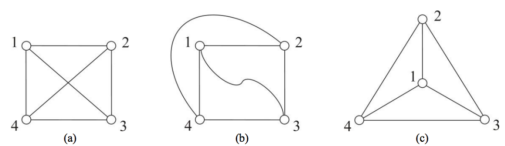
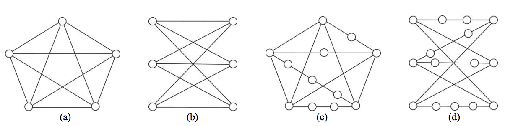
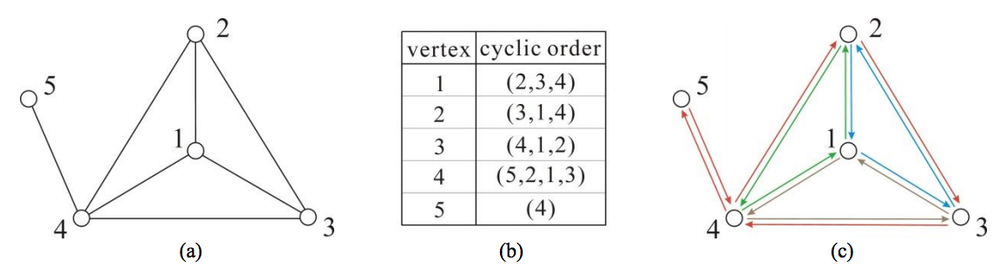

## 문제

In this problem, we consider only finite simple undirected graphs that are connected. A planar graph is a graph that can be drawn in the plane in such a way that no two edges cross each other, i.e., its edges intersect only at their end-vertices. Such a drawing is called a planar drawing of the graph. Refer to Figure 1 for an example of a planar graph and its planar drawings. It has been known that every planar graph admits a planar drawing such that all edges are straight line segments which do not intersect.

Figure 1. A planar graph and its planar drawings: (a) a complete graph with four vertices; (b) a planar drawing with curved edges; (c) a planar straight-line drawing.

The problem of testing if a given graph is planar is well studied. So, many algorithms for the problem have been designed and implemented, where most of the algorithms run in time linear to the number of vertices in the graph. Sometimes, the users of a planarity testing program expect something more than just a yes or no answer, so as to be sure of the correctness of the output. Recall that the programmers have made mistakes in implementing algorithms that were proven correct. This motivates the study of so-called certifying algorithms.

When the user gives X as an input and the program outputs Y, the user usually has no way of knowing whether Y is a correct output on input X or it has been compromised by a bug. A certifying algorithm is an algorithm that produces, with each output, a certificate Z that the particular output has not been compromised by a bug. By inspecting the certificate, either manually or by use of a program, the user can convince himself/herself that the output is correct, or reject the output as buggy. The process of checking Z can be automated with a checker, which is an algorithm for verifying that Z proves that Y is a correct output for X.

Let us think of the certificates that should be produced by a certifying algorithm for the planarity testing problem. If the input graph is planar, a planar drawing of the graph will be an obvious certificate. If the graph is non-planar, we can utilize Kuratowski’s theorem, which states that a graph is planar if and only if it does not contain a subgraph that is a subdivision of K5 or of K3,3. Here, K5 shown in Figure 2(a) is a complete graph with five vertices; K3,3 shown in Figure 2(b) is a complete bipartite graph with three vertices in each bipartition set; a subdivision of a graph is what is obtained by repeatedly subdividing edges by inserting vertices of degree two on them, as illustrated in Figures 2(c) and 2(d). That is, a subdivision of a graph can be obtained if we replace the edges of the graph with independent paths between their end-vertices (so that none of these paths has an inner vertex on another path or in the graph). Thus, if a graph is non-planar, its connected subgraph that is a subdivision of K5 or of K3,3 will be a good certificate.

Figure 2. K5, K3,3, and their subdivisions: (a) K5; (b) K3,3; (c) a subdivision of K5; (d) a subdivision of K3,3.

In contrast to the problem of checking if a graph is a subdivision of K5 or of K3,3, it is no easy task to check effectively if a drawing is actually planar. So, a combinatorial embedding defined below is adopted, instead of a planar drawing, as a certificate for the affirmative case. A straight-line drawing of a graph (in which no positions of three vertices are collinear) uniquely defines, for each vertex v of the graph, the cyclic order of the vertices adjacent to v; for convenience, we use clockwise order. The set of all these cyclic orders is called a combinatorial embedding. Figure 3 shows a planar drawing and its corresponding combinatorial embedding. In the cyclic order (2,3,4) for instance, the vertex next to 2, 3, and 4, respectively, are 3, 4, and 2.

Figure 3. A planar drawing and its combinatorial embedding: (a) a planar drawing; (b) its combinatorial embedding; (c) the four boundary cycles of the combinatorial embedding.

To check whether a combinatorial embedding is indeed planar, we introduce the notion of a boundary cycle in the directed graph obtained by replacing each undirected edge by two directed edges in opposite directions. The boundary cycle starting at a directed edge (u, v) is defined as follows: If u′ is the vertex next to u in the cyclic order for v, then (v, u′) is the next edge of the boundary cycle. We continue in this way until we return to the starting edge (u, v). For example, if we start at a directed edge (5,4) in the directed graph shown in Figure 3(c), then the next edge will be (4,2) because the vertex next to 5 is 2 in the cyclic order (5,2,1,3) for the vertex 4. If we continue, we obtain a boundary cycle: (5,4) ⇒ (4,2) ⇒ (2,3) ⇒ (3,4) ⇒ (4,5) ⇒ (5,4). It was proven that a combinatorial embedding always leads to a partition of the set of directed edges into a set of boundary cycles, and moreover, for a connected graph with n > 1 vertices and m edges, a combinatorial embedding of the graph with f boundary cycles is planar if and only if n − m + f = 2. Therefore, it suffices to count the number of boundary cycles and determine if the equation n − m + f = 2 holds true.

Suppose we are given an input graph X, as well as the output Y and the certificate Z of a certifying algorithm for the planarity testing problem. Here, Y is of course a yes or no answer; Z is a combinatorial embedding or a subgraph of the input graph X depending on the answer. A checker program may be composed of two modules: (i) one module for testing if the combinatorial embedding Z is planar for the affirmative case, also for testing if the subgraph Z is a subdivision of K5 or of K3,3 for the negative case; (ii) the other module for testing if Z is a combinatorial embedding or a subgraph of the input graph X again depending on the output Y. Your job is to write the first module of the checker program. It is assumed that the graph X has n vertices that are indexed 1 to n.

## 입력

Your program is to read from standard input. The first line contains an integer indicating the output of a certifying algorithm, where the integer is 1 in the affirmative case while the integer is -1 in the negative case.  It follows the certificate produced by the certifying algorithm. For the affirmative case, a line containing an integer n, the number of vertices of the graph X, is followed by the combinatorial embedding described through n lines, each contains the cyclic order of vertex k from 1 to n, in the form of dk, x1, x2, …, xdk representing the cyclic order (x1, x2, … , xdk) made of dk vertices. For the negative case, a line containing the integer n is followed by the connected subgraph produced by the certifying algorithm. The subgraph is described as follows: a line that contains two positive integers n′ and m′ respectively representing the numbers of vertices and edges of the subgraph is followed by m′ lines, each contains two integers u and v that represent an edge between vertex u and vertex v of the subgraph. You may assume that 2 ≤ n ≤ 5,000 and also, each vertex of the subgraph is contained in the set {1, … , n}.

## 출력

Your program is to write to standard output. Print exactly one line that contains an integer indicating whether the combinatorial embedding Z is planar for the affirmative case, and whether the subgraph Z is a subdivision of K5 or of K3,3 for the negative case. If yes, the integer must be 1; otherwise -1.
