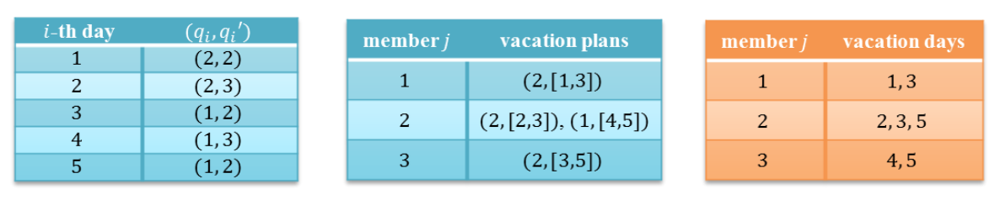

## 문제

A team composed of m members is going to carry out a project in n contiguous working days. You are helping the team to set up the vacation schedules of the members. Every member is bound to work for at least p and at most p′ working days for the project and, in particular, the number of team members required to work on the i-th working day is between qi and qi′, inclusive, for i = 1, … , n. Also, each member has a series of vacation plans

(d1,[r1, r1′]), (d2,[r2, r2′]), … , (dk,[rk, rk′]),

which indicate that the member wants to take at least di vacation days from the working-day period [ri, ri′] for each i = 1, … , k, and wants to work on a day not included in the union of the period [ri, ri′] over all i, i.e., ⋃ki=1{r: ri ≤ r ≤ ri′}. Note that the vacation days are presumably not fixed in a vacation plan. If a member has a vacation plan (2,[7,9]) for instance, he/she may take a two-day vacation {7,8}, {7,9}, {8,9}, or happily a three-day vacation {7,8,9}; whereas for some vacation plans, say (2,[3,4]), the vacation days are fixed.

Given the information on the project team and the vacation plans for the team members, you are to write a computer program that determines if it is possible to assign vacation days to each of the members in a way that everyone is happy, subject to the aforementioned constraints. Such an assignment of vacation days is called a vacation schedule. It is assumed that the members are indexed from 1 to m.

For example, suppose you are given m = 3, n = 5, and (p, p′) = (2, 3), as well as (qi, qi′) for working day i ∈ {1, … ,5} shown in the table below (left) and the vacation plans for member j ∈ {1,2,3} shown in the table (center). You can make vacation schedules of the members that satisfy all the constraints, as shown in the table below (right).

## 입력

Your program is to read from standard input. The first line of the input contains four positive integers m, n, p and p′ whose meaning has been described above, where m ≤ 100, n ≤ 100, and p ≤ p′ ≤ n. In the following n lines, each line contains two positive integers qi and qi′ for i = 1 to n, where qi ≤ qi′ ≤ m for all i. Then, m lines follow, where the j-th line contains the vacation plans for the member j. The vacation plans of a member, denoted by (d1,[r1, r1′]), (d2,[r2, r2′]), … , (dk,[rk, rk′]) , is represented by a sequence of 3k + 1 positive integers as follows: k, d1, r1, r1′, d2, r2, r2′, …, dk, rk, rk′. The number of vacation plans of a member is no more than 20. You may assume that ri ≤ ri′ ≤ n and di ≤ ri′ − ri + 1 for all i ∈ {1, … , k}, r1 < r2 < ⋯ < rk, and moreover two periods [ra, ra′] and [rb, rb′] are disjoint whenever a ≠ b, i.e., they do not contain a common working day if a ≠ b and a, b ∈ {1, … , k}.

## 출력

Your program is to write to standard output. The first line must contain an integer indicating whether or not there exist vacation schedules of the team members that satisfy all the constraints. If yes, the integer must be 1; otherwise -1. When and only when the first line is 1, it must follow m lines containing, one by one, the vacation schedules for member j = 1 to m, where the vacation schedule of a member is described by the number of vacation days followed by the vacation days in ascending order.
