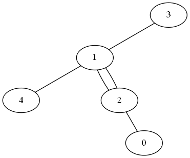
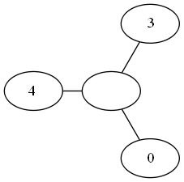

## 문제

N개의 도시와 N개의 양방향 도로로 이루어진 나라가 있다. 이 나라의 도시는 0번부터 N-1번까지 번호가 매겨져 있다. 도로는 길이가 N인 수열 Ri로 정의되며, 도시 i와 도시 Ri를 연결하는 도로가 있다는 의미이다. 즉, 어떤 도시 쌍은 연결하는 도로가 2개일 수도 있다. 또, 항상 임의의 두 도시를 도로를 이용해서 이동할 수 있다.

이 나라의 대통령은 도시 중의 하나를 수도로 정하려고 한다. 수도는 반드시 다음과 같은 조건을 만족하게 골라야 한다.

서로 다른 두 도시 A와 B를 골랐을 때, A에서 B로 이동하는 단순 경로에 꼭 수도를 방문해야 한다.

만약, 위와 같은 조건을 만족하는 수도가 없을 때는, 새로운 도시를 만들어야 한다. 새로운 도시를 만드는 방법은 인접한 두 도시를 통합해서 새로운 도시로 만드는 것이다. 통합은 여러 번 할 수 있으며, 다음과 같은 과정을 거친다.

* 도로로 연결되어 있는 두 도시 X와 Y를 고른다. 문제의 조건에 따라서, 두 도시 사이에 도로가 1개보다 많을 수도 있다.
* 두 도시를 합치고 새로운 도시 Z를 만든다.
* X와 Y사이의 도로는 모두 사라지게 되고, X 또는 Y와 연결된 다른 도시는 Z와 연결된다.

예를 들어, 아래와 같은 그래프를 살펴보자.

이 상황에서는 수도를 정할 수 없다. 1과 2번 도시를 통합하면 아래와 같은 그래프가 나오게 된다.

새로 만든 도시를 수도로 정하면 된다.

N과 Ri가 주어졌을 때, 수도를 정하기 위해서 해야하는 통합의 최소 횟수를 구하는 프로그램을 작성하시오.

## 입력

첫째 줄에 N이 둘째 줄에 Ri가 순서대로 주어진다. (2 ≤ N ≤ 50, 0 ≤ Ri ≤ N-1)

## 출력

첫째 줄에 수도를 정하기 위해 해야하는 통합의 최소 횟수를 출력한다.
