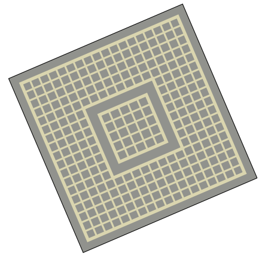
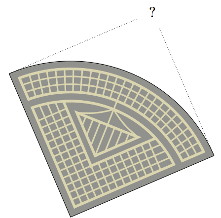

## 문제

In the heart of your home city, there is an old square, close to the train station, appropriately  
called Station Square. It used to look like a perfect square: four sides of equal length joined by right angles. However, it hasn’t looked like this for decades, as one of the four corners was destroyed by bombings in the Second World War. After the war, the square was rebuilt as a quarter circle, and it has looked like that ever since. (In other words, it looks like an isosceles right triangle, except that the hypothenuse is not a straight line but a circular arc.) This is illustrated in the figure below, which corresponds with Sample Input 1.

(a) The old square, in the shape of an actual square. / (b) The current square, looking more like a quarter circle.

Recently, the city counsil voted to completely remodel the train station and its surroundings, which includes restoring Station Square to its original state. Therefore they need to determine the exact location of the fourth corner. This task is too complicated for ordinary aldermen, so the city decided to hire a top scientist. That would be you! Please help the city complete the square, and you will be greatly rewarded!

## 입력

There are three lines of input. Each line contains two integers denoting the x and y coordinates of one of the corners of the current square (−104 ≤ x, y ≤ 104).

## 출력

Output one line with two space-separated integers denoting the x and y coordinates of the long-lost fourth corner.
