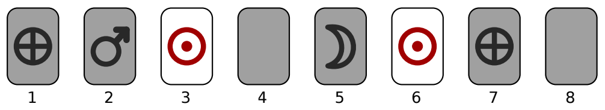

## 문제

You are playing the game “Memory Match”.

This game revolves around a set of N picture cards. The cards are organized in pairs: there are N/2 different pictures, each picture occurring on exactly two cards.

At the beginning of the game, the cards are shuffled and laid face down on the table. Players then take turns in guessing a pair of cards with the same picture. Each turn consists of picking a face-down card and turning it over to reveal its picture, then picking another face-down card and turning that card over as well. If the pictures on the two turned cards are identical, the cards remain face-up, the player scores a point and may take another turn. If the pictures are different, both cards are turned face-down again and the turn goes to the next player.

It is now your turn! Given a description of all previous actions in the game, pick as many matching pairs as possible.

  
Figure 1: Illustration of the first example input. Only cards 3 and 6 have been matched correctly, all other cards are face-down. How many pairs can you score?

## 입력

The first line contains an even integer N, the number of cards on the table (2 ≤ N ≤ 1000).

The second line contains an integer K, the number of turns played thus far in the game (0 ≤ K ≤ 1000).

The following K lines each describe a turn. A turn is described by integers C1 and C2followed by words P1 and P2. The numbers C1 and C2 refer to card positions on the table (1 ≤ C1, C2 ≤ N and C1 ≠ C2). The words describe the pictures on the two selected cards. Each word consists of between 1 and 20 lowercase letters in range ‘a’ . . . ‘z’. If P1 = P2, the two cards stay face-up and the corresponding positions C1 and C2 may not be chosen again.

The input is such that at least two cards are still in face-down position.

## 출력

Output one line with an integer S, the number of matching pairs you can score with certainty.
