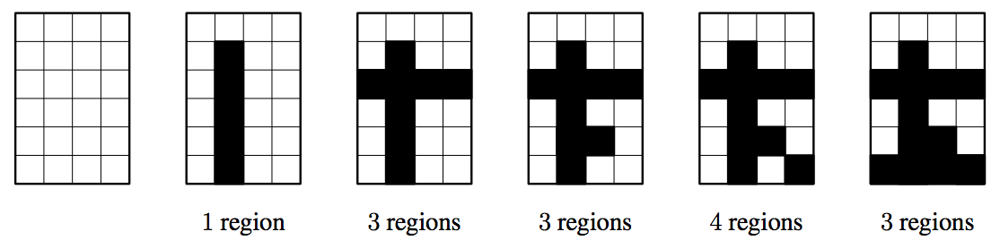

## 문제

A template for an artwork is a white grid of n × m squares. The artwork will be created by painting q horizontal and vertical black strokes. A stroke starts from square (x1, y1), ends at square (x2, y2) (x1 = x2 or y1 = y2) and changes the color of all squares (x, y) to black where x1 ≤ x ≤ x2 and y1 ≤ y ≤ y2.

The beauty of an artwork is the number of regions in the grid. Each region consists of one or more white squares that are connected to each other using a path of white squares in the grid, walking horizontally or vertically but not diagonally. The initial beauty of the artwork is 1. Your task is to calculate the beauty after each new stroke. Figure A.1 illustrates how the beauty of the artwork varies in Sample Input 1.

  
Figure A.1: Illustration of Sample Input 1.

## 입력

The first line of input contains three integers n, m and q (1 ≤ n, m ≤ 1000, 1 ≤ q ≤ 104).

Then follow q lines that describe the strokes. Each line consists of four integers x1, y1, x2and y2 (1 ≤ x1 ≤ x2 ≤ n, 1 ≤ y1 ≤ y2 ≤ m). Either x1 = x2 or y1 = y2 (or both).

## 출력

For each of the q strokes, output a line containing the beauty of the artwork after the stroke.
