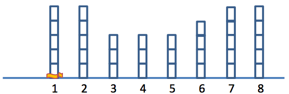
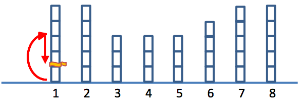
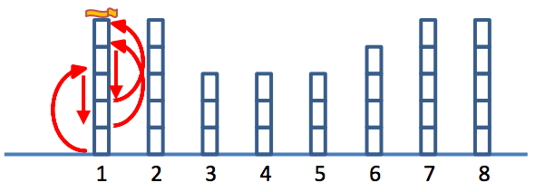
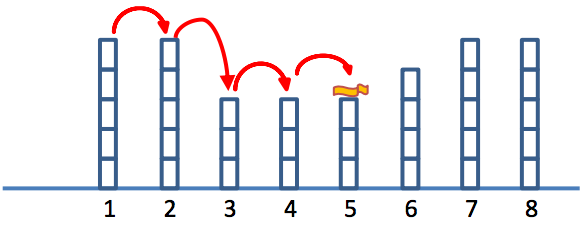
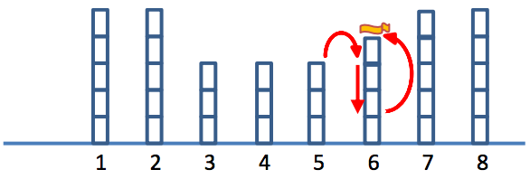
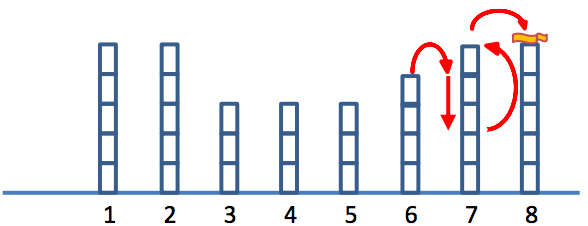
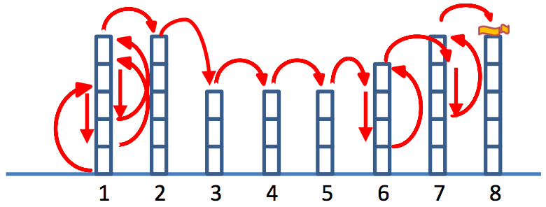
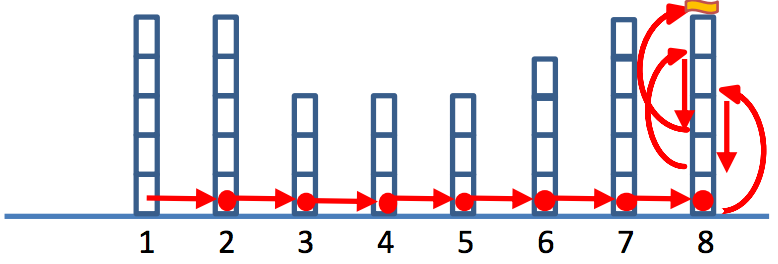
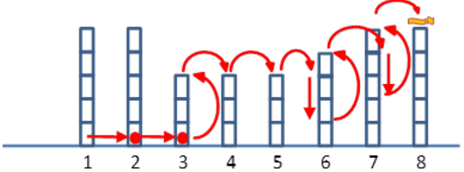

## 문제

The forest where a little worm lives has N trees, neatly located at positions 1to N. The worm dreams to be the first ever being to place its slimy belly on the moon... Nah, not really. Well, he just wants to be at the top of the N th tree. Right now, the little worm is at the base of the 1st tree. He can move in one of the following two ways:

1. When he is on the ith tree, he can climb up ui units at a time. The height after any climb will never be higher than the height of the tree.
2. He can jump from the ith tree to an adjacent tree (the (i – 1)th or the (i + 1)th tree). The worm is a good jumper, so he can jump to the same height on the nearby tree. However, if the top of the adjacent tree is lower than the worm’s current height, the worm will end up on the top of this lower tree.

Each move takes the worm 1 second. But, after each move, the worm has to rest for 1 second. During this time, he will fall down due to gravity for diunits if he is on the ith tree. Yet he cannot go below height 0. There is an exception to this rule: when he jumps to the top of atree, he does not have to rest;hecan continue moving right after his previous move. Because trees are generally different, the ui and di of different tree can be different.

Remarks: Each of the two maneuvers requires exactly 1 second, even in the cases where the movement does not go the full length because it reaches the top or the bottom of a tree.

Example: There are 8 trees, whose heights from left to right are 5, 5, 3, 3, 3, 4, 5, and 5 units, as shown below. All the ui ’sare 3 units per second, and the di ’sare 2 units per second. Figures a) to g) show one possible way for the little worm to move from the starting position, the base of the first tree, to the top of the 8th tree in Figure f).

a) The little worm begins at the base of the first tree.

b) After the worm climbed 3 units up and fell 2 units down during the wait, he ended up at the position of the flag.

c) He must spend 5 seconds to get to the top.

d) Then, he jumpped to the tree 2, 3, 4, 5 on the 6th, 7th, 8th, 9th seconds respectively without having to rest.

e) While on the 6th tree, the little worm was not at the top, so he must rest for 1 second. During the time, he fell down 2 units. Then, he moved to the top of the tree again.

f) The little worm continued its journey to the top of the 8th tree.

g) This figure summarized the trip of the little worm from Figure a) to Figure f). The total time required for this trip is 16 seconds.

Now if the worm decides to instead jump from the base of one trees to the next as shown in the figure below, and only climbs up on the last tree, he will take a total of 19 seconds. Note that since the jump is not made at the top, he must rest for 1 second (shown as dots). Also, since the worm is at the base, he cannot fall further while resting.

It turns out for this particular example, the shortest possible travel time for the little worm is 14 seconds, as shown in the figure below.

Your task Given N trees, the ui and di of all trees, find the shortest travel time (in seconds) from the base of the 1st tree to the top of the Nth tree.

## 입력

For the first line, there is a single integer, K, representing the number of test cases. For each test case, there are 4 lines. (1 ≤ K ≤ 10)

1. The first line contains a single integer, N, the number of the trees (0 < N ≤ 1000).
2. The second line contains N numbers, hi , where i goes from 1 to N. Note that hi represents the height of each tree. (1 ≤ hi ≤ 1000)
3. The third line contains N numbers, ui , where i goes from 1 to N. Note that ui represents the climb rate of each tree. (1 ≤ ui ≤ 1000)
4. The fourth line contains N numbers, di , where i goes from 1 to N. Note that di represents the fall rate of each tree. (1 ≤ di ≤ 1000)

## 출력

For each test case, you print out on a single line the shortest travel time of the little worm. However, if it is not possible to reach the top of the Nth tree, you must print, in capital letter, the word “NEVER”, without the quotation.
