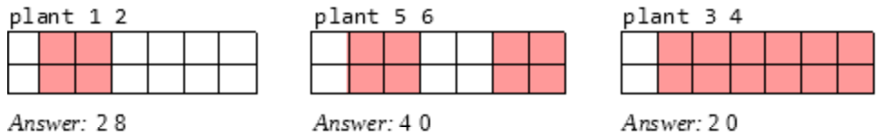
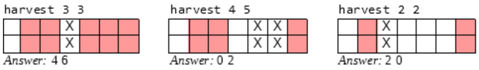

## 문제

Farmer Yam just bought a piece of land that she will turn into a carrot farm. The land is a rectangle W (1 ≤ W ≤ 108) units wide and L (1 ≤ L ≤ 10) units long. Yam likes to think of it as an integer grid. The cells are numbered 0, 1, …, L – 1 through the length and 0, 1, …, W – 1 through the width. As a big planner, Yam has formulated a sequence of actions for her farming endeavor. Her sequence has length n (1 ≤ n ≤ 50,000). You will help Yam simulate her plan so she can answer some questions.

There are only two kinds of actions in Yam's plan: 1. plant carrot seeds or 2. harvest from existing plantations. The land is initially empty. Yam may mix the actions as she likes. The details of each action are as follows (you may also find sample input/output useful):

The plant action is to plant seeds between two given cell numbers on the wide side, occupying the full length of the land. If plantation areas touch, they will be merged into one. We promise that the new plantation area does not overlap with (though it may touch) any current plantation areas. After merging touching plantations (if any), you will report two numbers: the area of the unoccupied land immediately to the left of your most-recent plantation and separately the area of the unoccupied land immediately to the right of your most-recent plantation.

The harvest action is to harvest everything between two given cell numbers on the wide side, going the full length of the land. The harvest may split a plantation into two. We promise that every given harvest area will be completely contained within a plantation. You will report two numbers: the area of the planted land immediately to the left of the area just harvested and separately the area of the planted land immediately to the right of the area just harvested.

## 입력

The first line contains the number of test cases T (1 ≤ T ≤ 7).

Each test case begins with a line containing three integers W L n as described above; the numbers are space-separated.

For that test case, each of the following n lines is of the format “action a b”, where action is either plant or harvest, and a and b (a < b) specify the lower- and upper- cell numbers for that action, respectively.

## 출력

For each action, print on its own line the two numbers you are expected to report, separated by a single space. At the end of every test case, print two dashes “--” (without quote) followed by a new line character.
