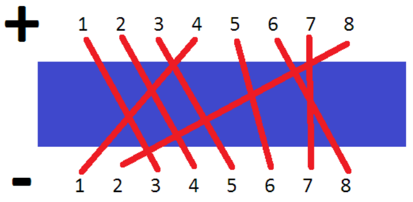

## 문제

Water pollution is a problem common to many metropolis around the world, and the ACM metropolis of ICPC country is not an exception. Many cities try to solve this problem by having sewage treated before dumping into water sources, but for the ACM metropolis this is not a viable solution because space is a scarce treasure.

Alternatively, the government of ACM metropolis decided to use a chemical method. Specifically, the government would dump a treatment chemical into rivers around the metropolis to purify the water. However, the chemical reaction requires sunlight, thus all bridges across the rivers are being converted to Glass Bridge.

Funnily enough, the glass bridges still blocks 50% of the sunlight. If two glass bridges stacked, it only let 25% of total sunlight passing through. This could be a problem, as the chemical agent requires at least 40% of total sunlight to works. Although unavoidable, the government want to minimize the area that has less than 40% of sunlight.

The government has plans to construct N more bridge over a river. These bridges may overlaps, and thus limiting the sunlight. Given that three-story bridge is not feasible to construct (limiting the crossing bridges to two at a time), government wants to know how many areas of the river are covered with two bridge.

The metropolis around the river is structured such that the District 1 is directly across from District -1, District 2 from District -2, and so on. Each district has bridge to one another district across the river.

## 입력

First line has the number of test cases, T (1 ≤ T ≤ 20)

For each test case, the first line contains N specifying the number of bridge to construct. (2 ≤ N ≤ 100 000)

Then on the next line are integers a1 a2 a3 … ai … an (1 ≤ ai ≤ N) saying that there are plan to construct bridge from District i to District –ai .

## 출력

For each test case, output a number of area that has bridge crossing each other.
