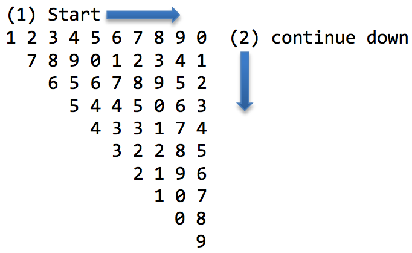

## 문제

Given the area of the N × N right triangle grid, we want to fill them in with numbers. The N × N right triangle has the legs of length N. For the purpose of the explanation, we place one side of the leg horizontally, and the other side vertically as shown in the figure below. Note that, the left most column is considered the 0 column. The right most column is the N- 1 column. And the top most row is considered the 0 row, and the bottom row is considered the N-1 row. For this problem, we want to fill the number in a circular manner. For the filling process, starting from the horizontal leg on the first row, at the opposite end of the right angle, then continue down vertically, and then move up diagonally to the left most of the second row. Then, the process continues starting from the second row, till there is no space in the triangle left to fill. The number that we must fill the will go from 0 to 9. However, we start the filling process from number 1 to 9, then restart from 0 and then continue to fill 1, 2, 3

For the case of N = 10, the resulting table is shown below. For this example, we filled in the triangle from (1) to (2) and then back toward (1) along the diagonal.

What is more interesting is the following. Once we know N, we can find out which number is filled in at a given row and column. From the example, where N = 10, if the position is row = 0, and column = 7, then it is filled with number 8. However, if the position is row = 5 and column = 7, then the number is 2. Your task is to write a program that can quickly find out the circular number in the right triangle given the row and column.

## 입력

The first line will contain the number of test cases T (1 ≤ T ≤ 10)

For each test case, the input is (Q + 1)-line long. The first line of each test case contains two integer, N and Q (separated by a single space). N is the size of the triangle, and Q is the number of positions that you have to find out which number has been filled at each position. (N ≤ 1 000 000, 1 ≤ Q ≤ 10).

For the next Q lines, each line contains two numbers, R and C (separated by a single space), where R is the interested row and C is the interested column. (0 ≤ R ≤ C < N) Note that row and column is count from index 0.

## 출력

For each interested position R and C, print out the filled in number in a single line, as shown in the output.
