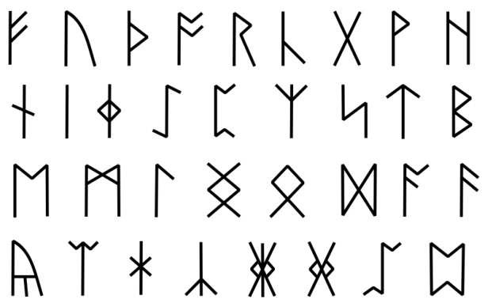

## 문제

Akara is a great wizard of Sanctuary. She is currently interested in runes, letters from an ancient language, which can enhance magic items and spells. Her recent studies show that some runes are more powerful than others.

Runes from Anglo-Saxon language.

Rune's power can be determined by a number of vowels (a, e, i, o, u) in its name. However, adjacent vowels will not increase its power more than once. For example:

1. Rune named ‘gattaca’ has a power of 3. Since there are 3 non-adjacent vowels in its name.
2. Rune named 'beautiful' also has a power of 3. Even though there are 5 vowels, because ‘eau’ are adjacency vowels and are counted as one.

Different languages have theirs own runes and cannot be mixed. Akara wants to rank her known runes from each language. So she can easily pick them up later. Your task, as her apprentice, is to write a program that takes lists of runes. Then print out every rune in that language from the most powerful to the least ones. If some of them fall in the same power level, show them in lexicographical order.

## 입력

The first line of input gives integer L, a number of languages you interested (1 < L ≤ 10)

Next L lines will start with N (1 < N ≤ 105), a number of runes in that language.

Following by N space-separated strings W indicated each rune. Each string W will contain only lowercase English alphabet (a-z) and has a maximum length of 100 characters.

## 출력

Output L lines. Each line contains N strings, separated by a single space. The strings must be ordered by its calculated rune's power. If some of them have the same power, order them lexicographically.
