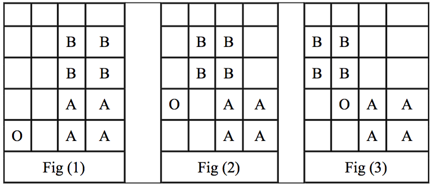

## 문제

A hero enters a dungeon full of traps. The dungeon is a 2D grid of R rows and C columns. Each cell in the grid is labeled by a coordinate (r, c) where 0 ≤ r < R and 0 ≤ c < C. Right now the hero is at (0, 0) and the exit of the dungeon is at (R-1, C-1). For every minute, the hero MAY move from any cell to a neighbor cell. Two cells are neighbor when they share a side. Be noted that the it is possible for the heroto stay at the same cell without moving.

There are K traps in this dungeon. Each trap is a rectangle area covering several cells. A trap is described by its bottom-left cell (pr, pc) and its top-right cell (qr, qc) which indicates that the trap occupies every cell (a, b) such that pr ≤ a ≤ qr and pc ≤ b ≤ qc. It is possible that some cell might be covered by more than one trap.

Obviously you cannot walk into a cell that is a trap. Moreover, traps in this dungeon might be moving. The i-th trap moves with the speed of <dr[i], dc[i]> cell per minutes. If currently a particular trap has its bottom-left coordinate at (pr, pc) and its top-left coordinate at (qr, rc), in the next minutes, this particular trap will has its bottom-left coordinate at (pr+dr[i], pc+dc[i]) and its top-left coordinate at (qr+dr[i], qc+dc[i]). However, if this movement of a particular trap at a particular minute will result in that trap moving outside the dungeon, that trap will not move at that minute.

Your task is to find the minimum time that you can reach the exit cell without ever being in a cell that is currently a trap. For simplicity, you can think of the movement as a two steps process where the hero moves first then the trap moves afterward. The check if the hero is in the cell with a trap is checked AFTER both the hero and the trap have already moved. Be noted that it is possible that traps might overlap. The overlapping of traps won't stop its movement.

## 입력

There are multiple test cases, the first line of input contain an integer T that gives the number of test cases (1 ≤ T ≤ 20). This is followed by T test cases described in the following format.

* The first line contains three integers R, C and K that give the size of the dungeon and the number of traps. (0 ≤ R,C ≤ 15; 0 ≤ K ≤ 20)
* The next K lines give the initial position and the speed the traps. Each line contains 6 integers pr, pc, qr, qc, dr and dc. These are the starting position of the bottom-left and top-right of the trap and its speed. (For each i-th trap, 0 ≤ pr[i] < qr[i] < R; 0 ≤ pc[i] < qc[i] < C; -1 ≤ dr[i],dc[i] ≤ 1.)

## 출력

For each test case, display the minimum time that the hero can reach the exit. If it is not possible for the hero to reach the exit, display -1.

## 힌트

The following tables shows the dungeon in the first example. The letter A and B shows the trap while O indicates the hero. In the first test case, the traps do not move and the dungeon is illustrated in Fig. (1). In the second test case, the trap A moves to the left and blocks the escaping path of the hero. Fig. (2) and (3) shows the dungeon at 1 minute and 2 minutes. Be noted that after the 2 minute, trap B no longer move because any more movement to the left after the that will make the trap B go outside the boundary

