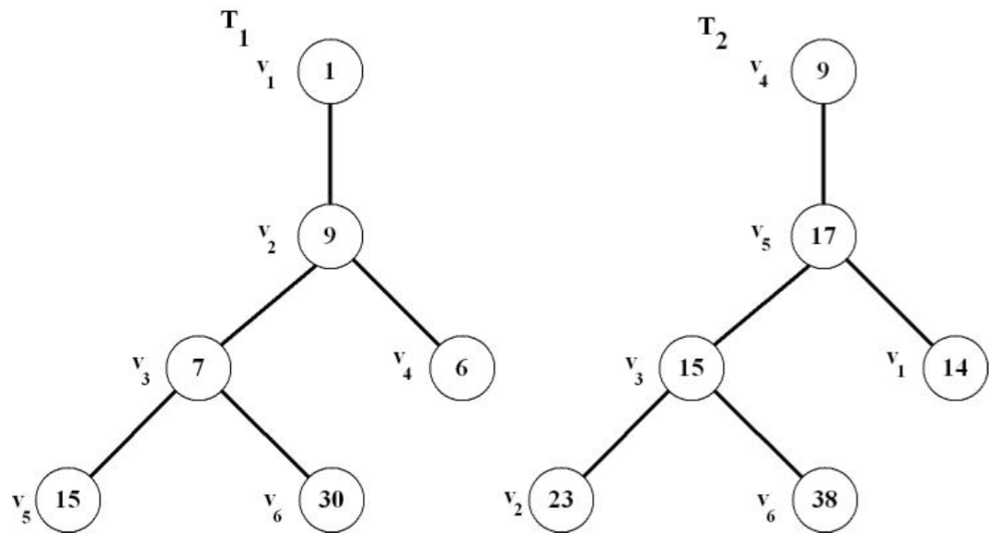

## 문제

A tree T = (V, E), where V = {v1, v2,..., vn} is a set of vertices and E = {e1, e2,..., en-1} is a set of edges, is a connected graph with no cycle. A labeled tree T = (V, E) is a tree, where each of its vertices has an associated unique number. More precisely, there is a one-to-one function mT : V → {..., -2, -1, 0, 1, 2,...}.

Let dT(u,v) = mT(u) - mT(v), where u, v ∈ V. Two labeled trees T1 = (V1, E1) and T2 = (V2, E2) are similar if and only if

1. |V1| = |V2|, and
2. There is a bijection such that (u,v) ∈ E1 if and only if (f(u),f(v)) ∈ E2. In other words, the trees are isomorphic.
3. Moreover, dT1(u,v)=dT2(f(u),f(v))for every(u,v) ∈ E1.

  
Figure 1: Trees T1 and T2 are similar.

In Figure 1, trees T1 and T2 are similar according to the definition. The bijection is as drawn in the figure. Furthermore, it can be verified, for instance, that (v1,v2)= 1 - 9 = -8 = 9 - 17 = (v4, v5) and (v2, v4) = 9 - 6 = 3 = 17 - 14 = (v5, v1). Also, (v2, v3) = 9 - 7 = 2 = 17 - 15 = (v5, v3).

Given d labeled trees, your job is to count similar trees.

## 입력

The first line of the input file contains the number of labeled trees d ≤ 100. 2 ≤ n ≤ 70,000. The following lines describe each tree and its labels. Each tree uses two lines to describe. The first line gives all edges of the tree. Tree nodes are numbered 1, 2, 3, ..., n. The second line gives the n labels of the tree in the order of vertices v1, v2, v3, v4,..., vn. -100,000< m(vi)< 100,000

## 출력

There is only one line in the output file. This line contains the numbers of similar trees in the increasing order. Note that the sum of all numbers in this line is d.

## 힌트

Explanation of Sample Output: The first two 1s indicate that there are 2 trees that are not similar to any other trees. The next number (2) indicates that there are two trees that are similar to each other. Finally, the number 3 indicates that there are three trees that are similar to each other. Notice that the counts of similar trees are listed in increasing order and they sum to 7, which is the total of number given trees.
