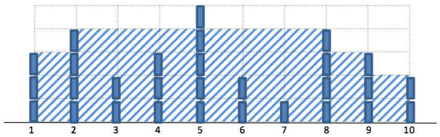
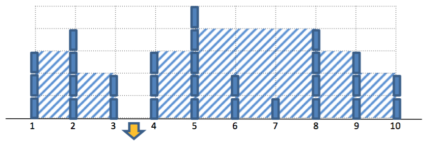
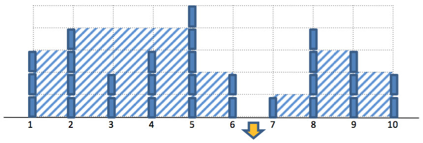

## 문제

In a big city, there are N walls arrange in a line from west to east, numbered by 1st to Nth. The walls are well designed and water-proof so water cannot pass through each wall. Unfortunately, it was raining heavily last week and the whole city had flooded by this heavy rain. The governor wants to put a super strong water pump to drain water as much as possible. He asks you to calculate maximum amount of water could be pumped out by a water pump.

Example

Suppose a line of walls in the city is shown as figure below.

  
After flooding by the heavy rain, water will be remained inside each pair of walls.

  
If the water pump is placed at the arrow marker, it can drain 7 units of water from the city.

  
However, one of the best positions to place the water pump is shown below at the arrow marker. 9 units of water would be drained.

  
Given heights of all walls, you task is to calculate maximum number of units of water could be drained by a water pump.

## 입력

First line contains an integer, T, represent the number of test cases. (1 ≤ T ≤ 20)   
For each test case, there are two lines of inputs. For i-th test case,

* Line 2\*i contains an integer: N represents the number of walls in the city. ( 1 ≤ N ≤ 100,000)
* Line 2\*i+1 contains N integers: h1, h2,...,hN represents height of each wall. hi presents the height of i-th wall. (0 ≤ hi ≤ 10,000 for every i)

## 출력

Answer in T lines. Each line contains an integer to answer each specific test case. Each answer shows the maximum amount of waters can be drained by a water pump.
