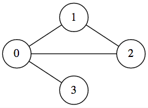
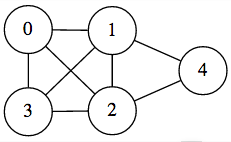

## 문제

N개의 정점으로 이루어진 무방향 무가중치 연결 그래프 G가 있다. 정점은 0번부터 N-1번까지 번호가 매겨져 있다.

이 그래프는 특별한 구조를 가지며, 두 배열 V와 sizes를 이용해서 나타낼 수 있다. V는 정점 번호를 담고 있는 배열이고, 같은 정점 번호가 여러 번 등장할 수 있다.

먼저, 모든 올바른 i에 대해서, S[i]를 sizes 배열의 처음 i개를 더한 값이라고 정의한다. 예를 들어, sizes = {10, 20, 30}인 경우에, S[0] = 0, S[1] = 10, S[2] = 10+20 = 30, S[3] = 10+20+30 = 60 이다.

그래프 G의 간선은 두 배열 V와 sizes를 이용해서 구할 수 있으며, 그 과정은 다음과 같다.

모든 올바른 i에 대해서, S[i] ≤ j < k < S[i+1]인 쌍 (j, k)를 모두 찾는다. 각각의 (j, k)쌍에 대해서, V[j]와 V[k] 사이에 간선이 있는 것이다. 이외의 다른 간선은 존재하지 않는다.

N, V, sizes가 주어졌을 때, 그래프 G의 모든 최단 경로의 길이의 합을 구하는 프로그램을 작성하시오. 입력으로 주어지는 그래프는 항상 연결되어 있는 그래프이다.

## 입력

첫째 줄에 N (2 ≤ N ≤ 2,500), V의 크기 M (1 ≤ M ≤ 5,000), sizes의 크기 K (1 ≤ K ≤ 2,500)이 주어진다.

둘째 줄에는 V에 들어있는 값이 순서대로 주어지며, 셋째 줄에는 sizes에 들어있는 값이 순서대로 주어진다.

V에 들어있는 값은 모두 0보다 크거나 같고, N-1보다 작거나 같으며, sizes에 들어있는 값은 2보다 크거나 같고, N보다 작거나 같은 자연수이다.

sizes 배열에 들어있는 값을 모두 더한 값은 M보다 작거나 같고, 모든 올바른 i에 대해서, V[S[i]], V[S[i]+1], ..., V[S[i+1]-1]은 서로 다른 값을 가진다.

## 출력

그래프 G에 존재하는 모든 경로의 길이의 합을 출력한다. 이 값은 32비트 정수를 넘을 수도 있다.

## 힌트

예제 1: 

예제 2: 
