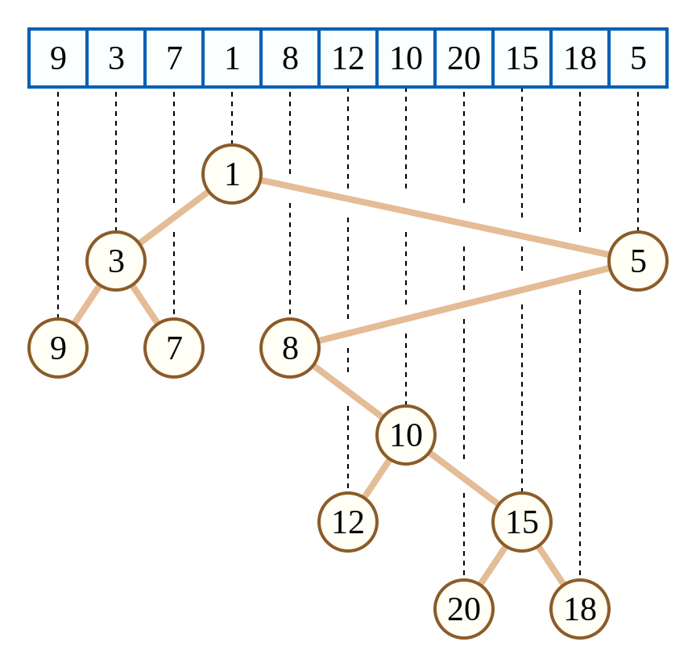

## 문제

현정이는 오늘 카르테시안 트리를 배웠고, 카르테시안 트리에 대한 자세한 설명은 [https://en.wikipedia.org/wiki/Cartesian\_tree](./001_Cartesian_tree) 에 나와있다. 다음은 카르테시안 트리에 대한 간단한 설명이다.

서로 다른 정수로 이루어진 수열 A가 있을 때, 수열 A를 이용해서 유일한 카르테시안 트리를 만들 수 있다. 카르테시안 트리는 다음과 같은 규칙을 지켜야 한다.

1. 카르테시안 트리는 루트 있는 바이너리 트리이다.
2. 트리의 각 노드는 A의 원소에 대응한다.
3. 트리를 인오더 순회했을 때, 수열 A와 순서가 같아야 한다.
4. 트리는 힙이다.

아래 그림은 A = [9, 3, 7, 1, 8, 12, 10, 20, 15, 18, 5] 를 이용해서 만든 카르테시안 트리이다.

수열 A를 이용해서 만든 카르테시안 트리를 T라고 했을 때, 카르테시안 트리 T의 점수는 다음과 같이 계산한다.

T에서 자식을 두 개 가지고 있는 노드를 찾는다. 그 다음, 각각의 노드에 대해서, 두 자식에 저장되어있는 값을 수열 A에서 찾는다. 그 다음 A에서의 인덱스의 차이를 모두 더한 것이 트리 T의 점수가 된다.

위의 그림의 경우에 자식 노드를 2개 가지고 있는 노드는 1, 3, 10, 15이다. 1은 노드 3과 5를 자식으로 가지고 있는데, 수열 A에서 인덱스는 1과 10이다. 따라서, 이 노드의 점수는 10 - 1 = 9가 된다. 자식을 2개 가지고 있는 다른 세 노드의 점수를 구해보면 2, 3, 2가 나오게 되고, 트리의 점수는 9 + 2 + 3 + 2 = 16이 된다.

N, MOD가 입력으로 주어진다. 1부터 N까지의 수로 이루어진 순열은 총 N!개가 있다. 이때, 각각의 순열은 카르테시안 트리를 만든다. 이때, 만들 수 있는 모든 카르테시안 트리의 점수의 합을 X라고 했을 때, X를 MOD로 나눈 나머지를 출력하는 프로그램을 작성하시오.

## 입력

첫째 줄에 N (1 ≤ N ≤ 100), MOD (3 ≤ MOD ≤ 109, MOD는 소수)가 주어진다.

## 출력

N!개의 순열로 만들 수 있는 모든 카르테시안 트리의 점수의 합을 MOD로 나눈 나머지를 출력한다.
