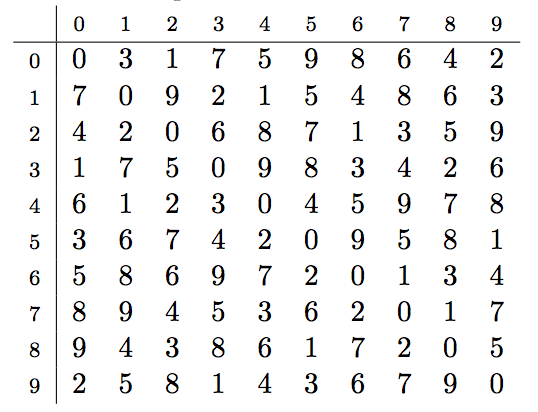
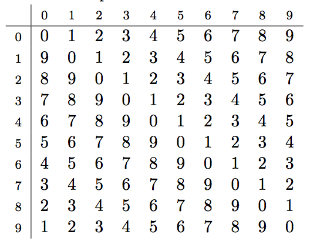
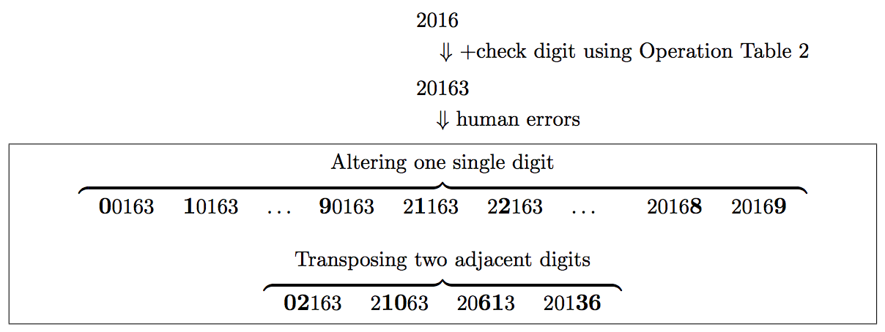

## 문제

The small city where you live plans to introduce a new social security number (SSN) system. Each citizen will be identified by a five-digit SSN. Its first four digits indicate the basic ID number (0000–9999) and the last one digit is a check digit for detecting errors.

For computing check digits, the city has decided to use an operation table. An operation table is a 10 × 10 table of decimal digits whose diagonal elements are all 0. Below are two example operation tables.

Operation Table 1



Operation Table 2



Using an operation table, the check digit e for a four-digit basic ID number abcd is computed by using the following formula. Here, i ⊗ j denotes the table element at row i and column j.

e = (((0 ⊗ a) ⊗ b) ⊗ c) ⊗ d

For example, by using Operation Table 1 the check digit e for a basic ID number abcd = 2016 is computed in the following way.

e = (((0 ⊗ 2) ⊗ 0) ⊗ 1) ⊗ 6 = (( 1 ⊗ 0) ⊗ 1) ⊗ 6 = ( 7 ⊗ 1) ⊗ 6 = 9 ⊗ 6 = 6

Thus, the SSN is 20166.

Note that the check digit depends on the operation table used. With Operation Table 2, we have e = 3 for the same basic ID number 2016, and the whole SSN will be 20163.



Figure B.1. Two kinds of common human errors

The purpose of adding the check digit is to detect human errors in writing/typing SSNs. The following check function can detect certain human errors. For a five-digit number abcde, the check function is defined as follows.

check(abcde) = ((((0 ⊗ a) ⊗ b) ⊗ c) ⊗ d) ⊗ e

This function returns 0 for a correct SSN. This is because every diagonal element in an operation table is 0 and for a correct SSN we have e = (((0 ⊗ a) ⊗ b) ⊗ c) ⊗ d:

check(abcde) = ((((0 ⊗ a) ⊗ b) ⊗ c) ⊗ d) ⊗ e = e ⊗ e = 0.

On the other hand, a non-zero value returned by check indicates that the given number cannot be a correct SSN. Note that, depending on the operation table used, check function may return 0 for an incorrect SSN. Kinds of errors detected depends on the operation table used; the table decides the quality of error detection.

The city authority wants to detect two kinds of common human errors on digit sequences: altering one single digit and transposing two adjacent digits, as shown in Figure B.1.

An operation table is good if it can detect all the common errors of the two kinds on all SSNs made from four-digit basic ID numbers 0000–9999. Note that errors with the check digit, as well as with four basic ID digits, should be detected. For example, Operation Table 1 is good. Operation Table 2 is not good because, for 20613, which is a number obtained by transposing the 3rd and the 4th digits of a correct SSN 20163, check(20613) is 0. Actually, among 10000 basic ID numbers, Operation Table 2 cannot detect one or more common errors for as many as 3439 basic ID numbers.

Given an operation table, decide how good it is by counting the number of basic ID numbers for which the given table cannot detect one or more common errors.

## 입력

The input consists of a single test case of the following format.

```

x00 x01 · · · x09
.
.
.
x90 x91 · · · x99
```

The input describes an operation table with xij being the decimal digit at row i and column j. Each line corresponds to a row of the table, in which elements are separated by a single space. The diagonal elements xii (i = 0, . . . , 9) are always 0.

## 출력

Output the number of basic ID numbers for which the given table cannot detect one or more common human errors.
