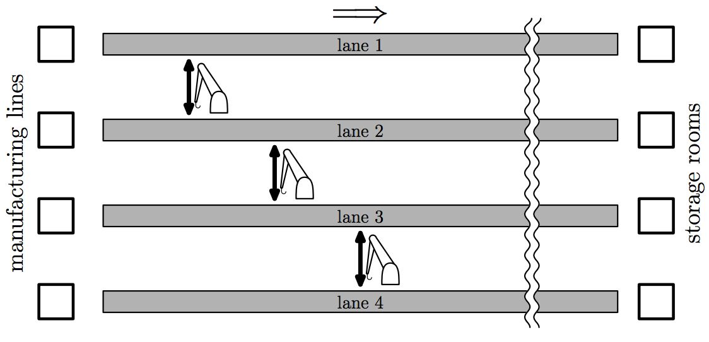

## 문제

The factory of the Impractically Complicated Products Corporation has many manufacturing lines and the same number of corresponding storage rooms. The same number of conveyor lanes are laid out in parallel to transfer goods from manufacturing lines directly to the corresponding storage rooms. Now, they plan to install a number of robot arms here and there between pairs of adjacent conveyor lanes so that goods in one of the lanes can be picked up and released down on the other, and also in the opposite way. This should allow mixing up goods from different manufacturing lines to the storage rooms.

Depending on the positions of robot arms, the goods from each of the manufacturing lines can only be delivered to some of the storage rooms. Your task is to find the number of manufacturing lines from which goods can be transferred to each of the storage rooms, given the number of conveyor lanes and positions of robot arms.

## 입력

The input consists of a single test case, formatted as follows.

```

n m
x1 y1
.
.
.
xm ym
```

An integer n (2 ≤ n ≤ 200000) in the first line is the number of conveyor lanes. The lanes are numbered from 1 to n, and two lanes with their numbers differing with 1 are adjacent. All of them start from the position x = 0 and end at x = 100000. The other integer m (1 ≤ m < 100000) is the number of robot arms.

The following m lines indicate the positions of the robot arms by two integers xi (0 < xi < 100000) and yi (1 ≤ yi < n). Here, xiis the x-coordinate of the i-th robot arm, which can pick goods on either the lane yi or the lane yi + 1 at position x = xi , and then release them on the other at the same x-coordinate.

You can assume that positions of no two robot arms have the same x-coordinate, that is, xi ≠ xj for any i ≠ j.



Figure C.1. Illustration of Sample Input 1

## 출력

Output n integers separated by a space in one line. The i-th integer is the number of the manufacturing lines from which the storage room connected to the conveyor lane i can accept goods.
