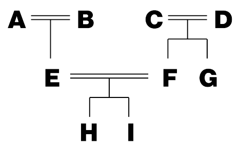

## 문제

You are an archaeologist at the Institute for Cryptic Pedigree Charts, specialized in the study of the ancient Three Kingdoms of Bourdelot. One day, you found a number of documents on the dynasties of the Three Kingdoms of Bourdelot during excavation of an ancient ruin. Since the early days of the Kingdoms of Bourdelot are veiled in mystery and even the names of many kings and queens are lost in history, the documents are expected to reveal the blood relationship of the ancient dynasties.

The documents have lines, each of which consists of a pair of names, presumably of ancient royal family members. An example of a document with two lines follows.

Alice Bob Bob Clare

Lines should have been complete sentences, but the documents are heavily damaged and therefore you can read only two names per line. At first, you thought that all of those lines described the true ancestor relations, but you found that would lead to contradiction. Later, you found that some documents should be interpreted negatively in order to understand the ancestor relations without contradiction. Formally, a document should be interpreted either as a positive document or as a negative document.

* In a positive document, the person on the left in each line is an ancestor of the person on the right in the line. If the document above is a positive document, it should be interpreted as “Alice is an ancestor of Bob, and Bob is an ancestor of Clare”.
* In a negative document, the person on the left in each line is NOT an ancestor of the person on the right in the line. If the document above is a negative document, it should be interpreted as “Alice is NOT an ancestor of Bob, and Bob is NOT an ancestor of Clare”.

A single document can never be a mixture of positive and negative parts. The document above can never read “Alice is an ancestor of Bob, and Bob is NOT an ancestor of Clare”.

You also found that there can be ancestor-descendant pairs that didn’t directly appear in the documents but can be inferred by the following rule: For any persons x, y and z, if x is an ancestor of y and y is an ancestor of z, then x is an ancestor of z. For example, if the document above is a positive document, then the ancestor-descendant pair of “Alice Clare” is inferred.

You are interested in the ancestry relationship of two royal family members. Unfortunately, the interpretation of the documents, that is, which are positive and which are negative, is unknown. Given a set of documents and two distinct names p and q, your task is to find an interpretation of the documents that does not contradict with the hypothesis that p is an ancestor of q. An interpretation of the documents contradicts with the hypothesis if and only if there exist persons x and y such that we can infer from the interpretation of the documents and the hypothesis that

* x is an ancestor of y and y is an ancestor of x, or
* x is an ancestor of y and x is not an ancestor of y.

We are sure that every person mentioned in the documents had a unique single name, i.e., no two persons have the same name and one person is never mentioned with different names.

When a person A is an ancestor of another person B, the person A can be a parent, a grandparent, a great-grandparent, or so on, of the person B. Also, there can be persons or ancestor-descendant pairs that do not appear in the documents. For example, for a family tree shown in Figure F.1, there can be a positive document:

A H B H D H F H E I

where persons C and G do not appear, and the ancestor-descendant pairs such as “A E”, “D F”, and “C I” do not appear.



Figure F.1. A Family Tree

## 입력

The input consists of a single test case of the following format.

```

p q
n
c1
.
.
.
cn
```

The first line of a test case consists of two distinct names, p and q, separated by a space. The second line of a test case consists of a single integer n that indicates the number of documents. Then the descriptions of n documents follow.

The description of the i-th document ci is formatted as follows:

```

mi
xi,1 yi,1
.
.
.
xi,mi
yi,mi
```

The first line consists of a single integer mi that indicates the number of pairs of names in the document. Each of the following mi lines consists of a pair of distinct names xi,j and yi,j (1 ≤ j ≤ mi), separated by a space.

Each name consists of lowercase or uppercase letters and its length is between 1 and 5, inclusive.

A test case satisfies the following constraints.

* 1 ≤ n ≤ 1000.
* 1 ≤ mi.
* \( \sum\_{i=1}^{n} m\_i ≤ 100000 \) , that is, the total number of pairs of names in the documents does not exceed 100000.
* The number of distinct names that appear in a test case does not exceed 300.

## 출력

Output “Yes” (without quotes) in a single line if there exists an interpretation of the documents that does not contradict with the hypothesis that p is an ancestor of q. Output “No”, otherwise.
