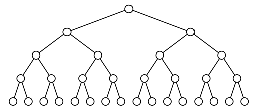
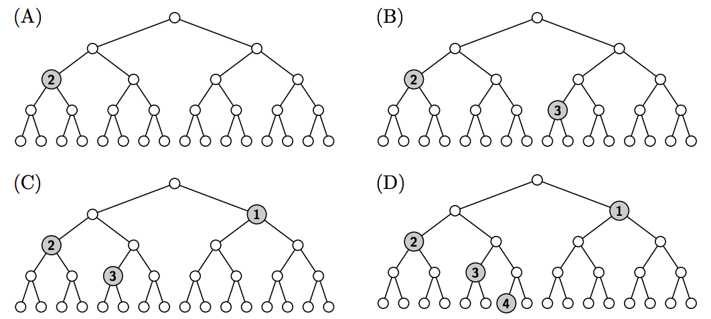

## 문제

You have drawn a chart of a perfect binary tree, like one shown in Figure G.1. The figure shows a finite tree, but, if needed, you can add more nodes beneath the leaves, making the tree arbitrarily deeper.



Figure G.1. A Perfect Binary Tree Chart

Tree nodes are associated with their depths, defined recursively. The root has the depth of zero, and the child nodes of a node of depth d have their depths d + 1.

You also have a pile of a certain number of medals, each engraved with some number. You want to know whether the medals can be placed on the tree chart satisfying the following conditions.

* A medal engraved with d should be on a node of depth d.
* One tree node can accommodate at most one medal.
* The path to the root from a node with a medal should not pass through another node with a medal.

You have to place medals satisfying the above conditions, one by one, starting from the top of the pile down to its bottom. If there exists no placement of a medal satisfying the conditions, you have to throw it away and simply proceed to the next medal.

You may have choices to place medals on different nodes. You want to find the best placement. When there are two or more placements satisfying the rule, one that places a medal upper in the pile is better. For example, when there are two placements of four medal, one that places only the top and the 2nd medal, and the other that places the top, the 3rd, and the 4th medal, the former is better.

In Sample Input 1, you have a pile of six medals engraved with 2, 3, 1, 1, 4, and 2 again respectively, from top to bottom.

* The first medal engraved with 2 can be placed, as shown in Figure G.2 (A).
* Then the second medal engraved with 3 may be placed , as shown in Figure G.2 (B).
* The third medal engraved with 1 cannot be placed if the second medal were placed as stated above, because both of the two nodes of depth 1 are along the path to the root from nodes already with a medal. Replacing the second medal satisfying the placement conditions, however, enables a placement shown in Figure G.2 (C).
* The fourth medal, again engraved with 1, cannot be placed with any replacements of the three medals already placed satisfying the conditions. This medal is thus thrown away.
* The fifth medal engraved with 4 can be placed as shown in of Figure G.2 (D).
* The last medal engraved with 2 cannot be placed on any of the nodes with whatever replacements.



Figure G.2. Medal Placements

## 입력

The input consists of a single test case in the format below.

```

n
x1
.
.
.
xn
```

The first line has n, an integer representing the number of medals (1 ≤ n ≤ 5 × 105). The following n lines represent the positive integers engraved on the medals. The i-th line of which has an integer xi (1 ≤ xi ≤ 109) engraved on the i-th medal of the pile from the top.

## 출력

When the best placement is chosen, for each i from 1 through n, output Yes in a line if the i-th medal is placed; otherwise, output No in a line.
