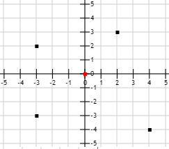

## 문제

오버워치에 빠진지도 어언 6개월. 50점에서 시작한 경쟁전 점수는 어느새 35점까지 내려와 버렸다. 알고리즘을 공부하느라 게임 실력이 떨어졌다고 생각한 규현이는 오버워치 경쟁전 점수를 올리기 위해 새로운 캐릭터 파라를 선택하여 연습을 시작하였다. 포화 개시! 처음 사격을 시작한 규현이의 파라는 형편없는 명중률을 보여주었지만, 곧이어 모든 미사일이 적의 로봇을 명중시키는 놀라운 결과를 얻어내었다. 파라를 계속 연습하던 규현이는 파라가 미사일을 쏘는 순간, 알고리즘 능력이 발휘되어 그 장면이 머릿속에서 좌표평면으로 그려졌다.

규현이의 파라는 (0,0) 의 위치에 있으며, 궁극기를 사용할 시 미사일을 적의 모든 로봇에게 동시에 직선으로 발사하여 맞춘다. 미사일의 날아가는 속도가 미사일마다 모두 달라 더 멀리 있는 적을 가까이 있는 적보다 더 빨리 맞출 수도 있게 된다. 알고리즘의 늪에서 빠져나올 수 없었던 걸까? 규현이는 적이 미사일에 격추되는 순서를 구하는 프로그램을 만들려고 한다. 규현이를 도와 프로그램을 작성하시오.

## 입력

첫째 줄에 N이 주어진다. N은 100,000보다 작거나 같은 수이다.

둘째 줄부터 총 N개의 줄에는 Xi, Yi, Vi 가 주어진다. 이는 i번째 로봇의 x, y 좌표와 미사일이 이 로봇을 향해 날아가는 속도를 의미한다. (|Xi, Yi|≤10,000, 0＜Vi ≤1,000)

입력값이 주어지는 대로 로봇이 나타난 순서를 의미하며, 맨 처음 나타난 로봇부터 1, 2, 3, ..., N번째 로봇으로 지정한다. x좌표와 y좌표가 같은 곳에 로봇이 2개 이상 존재하는 경우는 없다.

## 출력

로봇이 격추되는 순서를 한 줄에 하나씩 출력한다. 동시에 격추되는 경우 더 작은 로봇의 번호를 먼저 출력한다.
