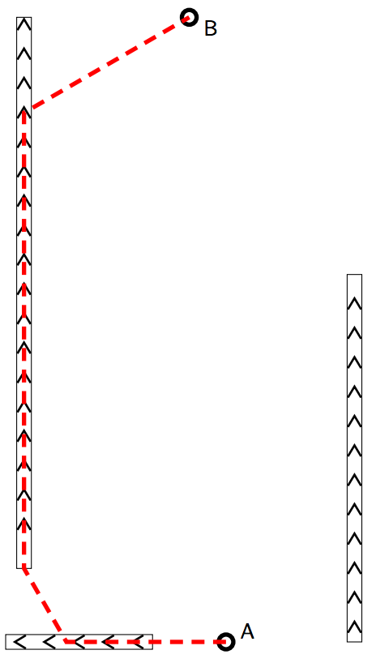

## 문제

Many airports have moving conveyor belts in the corridors between halls and terminals. Instead of walking on the floor, passengers can choose to stand on a conveyor or, even better, walk on a conveyor to get to the end of the corridor much faster.

The brand new Delft City Airport uses a similar system. However, in line with the latest fashion in airport architecture, there are no corridors: the entire airport is one big hall with a bunch of conveyor lines laid out on the floor arbitrarily.

To get from a certain point A to a certain point B, a passenger can use any combination of walking on the floor and walking on conveyors. Passengers can hop on or off a conveyor at any point along the conveyor. It is also possible to cross a conveyor without actually standing on it.

Walking on the floor goes at a speed of 1 meter/second. Walking forward on a conveyor goes at a total speed of 2 meter/second.

Walking in reverse direction on a conveyor is useless and illegal, but you may walk on the floor immediately next to the conveyor. (Conveyors are infinitely thin.)

How fast can you get from A to B?

Figure 1: Fastest route for first example input.

## 입력

The first line contains four floating point numbers, XA, YA, XB, and YB. They describe the coordinates of your initial location A = (XA, YA) and your final location B = (XB, YB).

The second line contains an integer N, the number of conveyors in the hall (0 ≤ N ≤ 100). The following N lines each contain four floating point numbers, X1, Y1, X2, and Y2, describing a conveyor which starts at the point (X1, Y1) and ends at the point (X2, Y2), running in a straight line from start to end.

All coordinates are floating point numbers in the range (0 ≤ X, Y ≤ 1000.0), expressed in units of meters.

Conveyors are at least 1 meter long. Conveyors do not intersect or touch.  
Your start and destination are not on any conveyor.

## 출력

Write one line with a floating point number, the minimum time (in seconds) needed to get from A to B in seconds.

Your answer may have an absolute error of at most 10−4.
