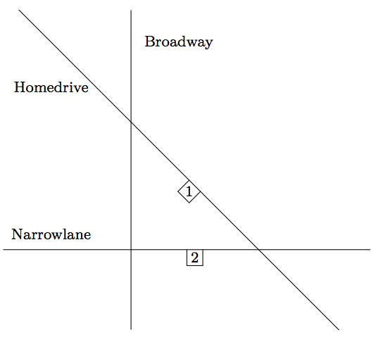

## 문제

Last week your little sister celebrated her birthday, and she was very pleased with her birthday present: a brand new scooter! Since then several times a day she goes for a drive, without telling anyone. She will leave the house, and go right on the pavement along the road. Fortunately she knows that she is not allowed to cross the road, and she is not sufficiently skilful with her new toy to turn around on the pavement. This means that, in order to continue her way, at each intersection she must turn right.

Every time your sister sets out, you are sent after her, of which you grow tired. Thus, knowing your little sister’s ways with her scooter, you decide to write a program to find her.

The city consists of R roads. Each road has a name which does not contain any spaces, and is an infinite line in the Euclidean plane. No three roads go through one point, i.e. at every intersection exactly two roads intersect. You figured out that your sister by this time should have completed N turns on the intersections of the city, unless of course she managed to leave the city by travelling on a road in a direction in which there is no other intersection, in which case she might not be able to even complete N turns. Your task is to write a program that tells you on which road your sister is right now.

## 입력

The first line contains four integers: the number of roads R, the number of turns N and the X- and Y -coordinate of your parents’ home, satisfying R ≤ 100, N ≤ 1010 and |X|, |Y | ≤ 107.

The next R lines each describe a street. Each line contains one string S (without spaces, containing only alphanumeric characters, of length at most 20), the name of the street, and four integers X1, Y1, X2, and Y2, satisfying |X1|, |X2|, |Y1|, |Y2| ≤ 107 and (X1, Y1) ≠ (X2, Y2), indicating that road S goes through points (X1, Y1) and (X2, Y2).

The location of your parents’ home (X, Y ) is guaranteed to lie on a unique non-vertical street (i.e. not on an intersection), on the south (negative Y -direction) side of the street, meaning that your little sister will depart in the east (positive X) direction. Moreover, each intersection is guaranteed to have coordinates of absolute value at most 107, and is guaranteed to lie at least 10−4from each other intersection in the same street.

## 출력

Output a single line containing the name of the road where your little sister can be found.

## 힌트

In the first case your sister starts on Homedrive heading east, turns right on Narrowlane, Broadway, Homedrive and Narrowlane, which means that after four turns she is in Narrowlane.
