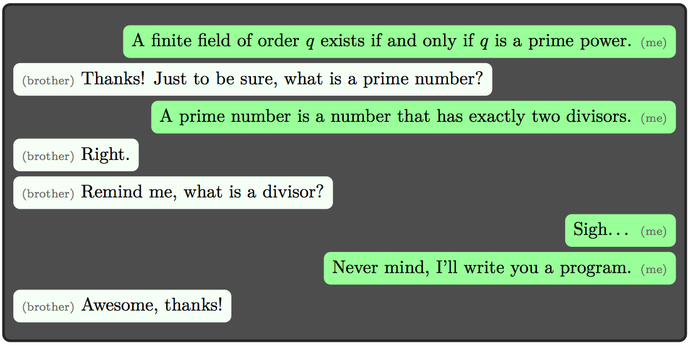

## 문제

Your older brother is an amateur mathematician with lots of experience. However, his memory is very bad. He recently got interested in linear algebra over finite fields, but he does not remember exactly which finite fields exist. For you, this is an easy question: a finite field of order q exists if and only if q is a prime power, that is, q = pk holds for some prime number p and some integer k ≥ 1. Furthermore, in that case the field is unique (up to isomorphism).

The conversation with your brother went something like this:

## 입력

The input consists of one integer q, satisfying 1 ≤ q ≤ 109.

## 출력

Output “yes” if there exists a finite field of order q. Otherwise, output “no”.
