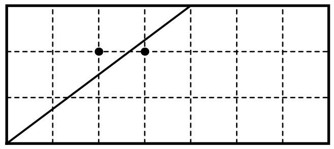

## 문제

Two students, Adam and Anton, are celebrating two-year anniversary of not passing their Math Logic exam. After very careful search in a local supermarket, they bought a rectangular cake with integer dimensions and two candles.

Later in the campus Adam put the candles into different integer points of the cake and gave a knife to Anton to cut the cake. The cut should start and end at integer points at the edges of the cake, and it should not touch the candles. Also each piece should have exactly one candle at it. Please, help Anton to find the starting and ending points of the cut.

A 7 × 3 cake and two candles at (2, 2) and (3, 2).  
Anton can cut this cake through (0, 0) and (4, 3).

## 입력

The single line of the input contains six integers: w, h — cake dimensions; ax, ay — x and y coordinates of the first candle; bx, by — the coordinates of the second candle (3 ≤ w, h ≤ 109; 0 < ax, bx < w; 0 < ay, by < h; ax ≠ bx or ay≠ by).

## 출력

Output four integers sx, sy, ex, and ey — the starting and ending coordinates of the cut. Both starting and ending point of the cut should belong to the sides of the cake.

If there are several solutions, output any of them.
