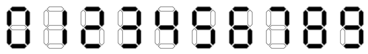
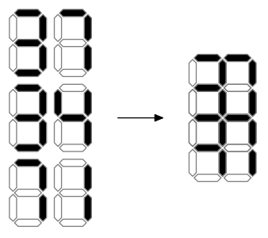

## 문제

Deidra is doing a columnar addition. She writes down two non-negative integer summands one below the other, left-pads them with zeroes so that they have equal length, and calculates the sum (e. g. 77 + 05 = 82). If the sum is longer than each of the summands (because of a carry, as in 96 + 07 = 103) she appends a zero at the beginning of each summand (096 + 007 = 103). She allows herself to use unnecessary leading zeroes (007 + 004 = 011) as soon as the length of all three numbers is the same.

Also Deidra has a homemade printing press. She decided to print her addition without a plus or a horizontal line, using the following standard font:

Unfortunately, she messed up with spacing, and all the digits were printed over each other in the following way. Digits that were supposed to be horizontally adjacent were printed so that the right two segments of the left digit coincide with the left two segments of the right digit. Digits that were supposed to be vertically adjacent were printed so that the bottom half (a square with 4 segments) of the upper digit coincides with the top half of the lower digit.

When one or more black segments are printed at the same position, the result looks black. When only empty segments are printed at the position, the result looks white.

Given the resulting picture, find a correct addition that could produce it or detect that there is none.

## 입력

The first line of the input contains an integer w (1 ≤ w ≤ 100) — the width of Deidra’s addition (number of digits in each line).

The following 9 lines contain the description of the picture printed with the bad spacing. Each line contains w or w + 1 digits. ‘1’ denotes a black segment, ‘0’ denotes a white one. Even lines start with a space. See the examples for clarification.

## 출력

If there is no valid addition, output “NO”.

Otherwise output a valid addition that produces the given figure. The output should consist of three lines, each containing w digits.

If there are several solutions, output any of them.
