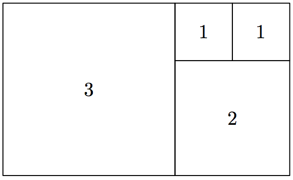
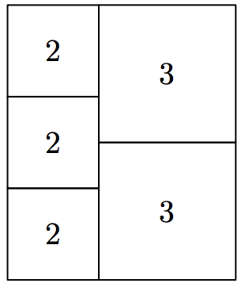
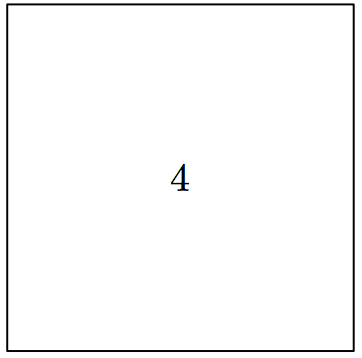

## 문제

Given a rectangle with integer side lengths, your task is to cut it into the smallest possible number of squares with integer side lengths.

## 입력

The first line contains a single integer T — the number of test cases (1 ≤ T ≤ 3600). Each of the next T lines contains two integers wi, hi — the dimensions of the rectangle (1 ≤ wi, hi ≤ 60; for any i ≠ j, either wi ≠ wj or hi ≠ hj ).

## 출력

For the i-th test case, output ki — the minimal number of squares, such that it is possible to cut the wi by hi rectangle into ki squares. The following ki lines should contain three integers each: xij , yij — the coordinates of the bottom-left corner of the j-th square and lij — its side length (0 ≤ xij ≤ wi − lij ; 0 ≤ yij ≤ hi −lij ). The bottom-left corner of the rectangle has coordinates (0, 0) and the top-right corner has coordinates (wi, hi).

## 힌트

Example case 1

Example case 2

Example case 3
