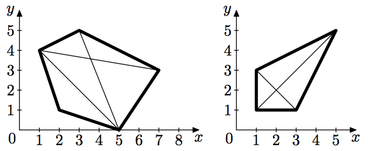

## 문제

Ingrid holds a polygon shop in a far away country. She sells only convex polygons with integer coordinates. Her customers prefer polygons that can be cut into two halves in a proper way, that is the cut should be straight with starting and ending points in the polygon vertices and both halves should be non-empty and have integer areas. The more ways to cut the polygon in the proper way are — the more expensive the polygon is.

For example, there are three ways to cut the left polygon in the proper way, and two ways for the right polygon.

The polygons in the shop are always of excellent quality, so the business is expanding. Now Ingrid needs some automatic tool to determine the number of ways to cut the polygon in the proper way. This is very important for her shop, since otherwise you will spend a lot of time on setting prices — just imagine how much time would it take to set prices for a medium-sized van with polygons. Could you help Ingrid and write the tool for her?

## 입력

The first line of the input contains an integer n — the number of polygon vertices (4 ≤ n ≤ 200 000). Each of the following n lines contains vertex coordinates: a pair of integers xi and yi per line (−109 ≤ xi, yi ≤ 109). The specified polygon is convex and its vertices are specified in the order of traversal.

## 출력

Output a single integer w — the number of ways to cut the polygon in the proper way.
