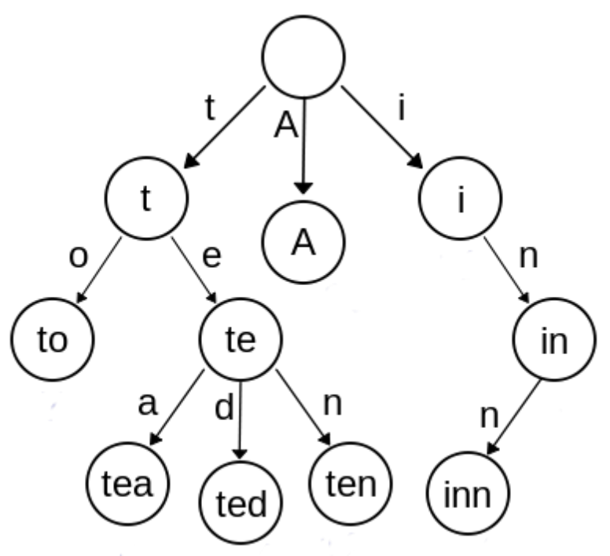

## 문제

Young hero, an adventurer Matej, has, after a long and strenuous journey, arrived to his final destination – the house of evil witch Marija. In order to complete his adventure, he must solve the final puzzle the witch gives him.

To even begin solving her puzzle, our hero needs to become familiar with the data structure called prefix tree (trie).

A prefix tree is a data structure that represents all prefixes of words from a certain set in the following way:

* Each edge of the tree is denoted with a letter from the alphabet.
* The root of the tree represents an empty prefix.
* All other nodes in the tree represent a non-empty prefix in a way that each node represents a prefix obtained by concatenating letters written on the edges that lead from the root of the tree to that node (in that order).
* There will never be two edges labeled with the same letter coming out of a single node (this way we minimize the number of nodes necessary to represent all prefixes).

Prefix tree for words: “A”, “to”, “tea”, “ted”, “ten”, “i”, “in”, i “inn”.

Only after Matej learned what a prefix tree was does the real puzzle begin!

The witch, as you may have guessed, has N words that consist of lowercase letters of the English alphabet. The puzzle would be very simple if the witch wanted to know the number of nodes of the prefix tree for that set of words, but she is not interested in this. She wants to know the minimal number of nodes a prefix tree can have after permuting the letters of each word in an arbitrary manner​.

Help Matej find the answer to the puzzle!

## 입력

The first line of input contains the integer N ​(1 ≤ N ≤ 16).

Each of the following N lines contains a single word consisting of lowercase letter of the English alphabet.

The total length of all words will be less than 1 000 000.

## 출력

The first and only line of output must contain a number, the answer to witch Marija’s puzzle.
