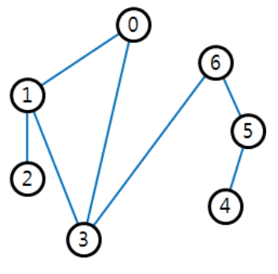

## 문제

There are n small islands and m bridges connecting them. The islands in the park are located along a circumference. A bridge in the park is connecting exactly two islands and no two bridges cross. Let us assume an island is a point. Then each island is located at the position of a vertex of a convex polygon which is a simple polygon whose all interior angles are strictly less than 180 degrees. Also, a bridge is considered as a straight line segment connecting two points, and no two segments cross except at the end points.

All islands are connected by the bridges, so a person on an island can visit all other islands through these bridges. The figure below shows an example of the bridge park.

One day, when a lot of tourists visited the park, there was an accident where a bridge was broken, thus some tourists were trapped on some isolated islands for a long time. After the accident, the park management committee made a plan of adding bridges such that all islands remain connected even if one bridge is broken. Of course, additional bridges must be straight line segments and should not intersect with any other bridges except for end points. The committee wants to know the minimum number of additional bridges required in order to achieve the goal with least cost.

Let (i,j) be the bridge connecting two islands i and j. In above figure, if the bridge (6, 3) is broken, the islands are partitioned into two connected components {0, 1, 2, 3} and {4, 5, 6}. If the bridge (5, 6) is broken, the islands are partitioned into two connected components {0, 1, 2, 3, 6} and {4, 5}. If the bridge (0, 3) is broken, the islands remain connected. If two bridges (2, 3) and (3, 4) are added, all islands remain connected even if any one bridge is broken.

Given the information of islands and bridges of the park, write a program to find the minimum number of additional bridges such that all islands remain connected even if any one bridge is broken.

## 입력

Your program is to read from standard input. The input starts with a line containing two integers, n and m (3 ≤ n ≤ 100,000, n − 1 ≤ m ≤ 2n − 3), where n and m are the numbers of islands and bridges of the  park, respectively. All islands are numbered from 0 to n − 1 and positioned at the vertices of a convex polygon. The ordered list (0, 1, 2, … , n − 1) is a sequence of islands visited when we traverse the boundary of the convex polygon in counterclockwise order. In the following m lines, two integers i and j (0 ≤ i,j ≤ n − 1) are given line by line, where (i,j) represents a bridge connecting the islands i and j. Note that all islands are connected by the bridges.

## 출력

Your program is to write to standard output. Print exactly one line which contains an integer which is the minimum number of additional bridges such that all islands remain connected even if one bridge is broken.
