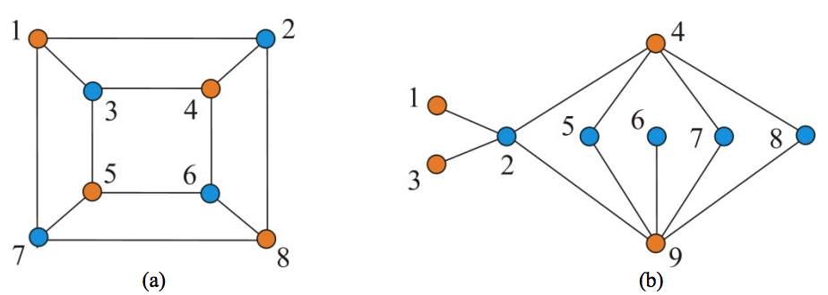

## 문제

Let G be a simple undirected graph. Two vertices of G are said to be adjacent if they are connected by an edge, and two edges of G are said to be adjacent if they share a vertex. In the graph shown in Figure 1(a), vertices 3 and 4 are adjacent because there is an edge (3,4) connecting them; edges (3,4) and (3,5) are adjacent because they share a vertex 3. A subset of vertices of G is called an independent vertex set if no two vertices in the subset are adjacent; also, a subset of edges of G is called an independent edge set if no two edges in the subset are adjacent. The size of a maximum independent vertex set, an independent vertex set of largest possible size, of G is called the vertex independence number and denoted by α(G); analogously, the size of a maximum edge independent set of G is called the edge independence number and denoted by ν(G).

Figure 1. Two graph G1 and G2: (a) graph G1, where α(G1) = 4 and ν(G1) = 4; (b) graph G2, where α(G2) = 6 and ν(G2) = 3.

The INDEPENDENT EDGE SET problem is the problem of finding a maximum independent edge set of a graph. The problem is well-studied, so many algorithms for the problem have been designed and implemented, where most of the algorithms run in time polynomial to the size of the graph. Sometimes, we expect something more than the output of a computer program, so as to be sure of the correctness of the output. This motivates the study of so-called certifying algorithms.

When the user gives X as an input and the program outputs Y, the user usually has no way of knowing whether Y is a correct output on input X or it has been compromised by a bug. A certifying algorithm is an algorithm that produces, with each output, a certificate Z that the particular output has not been compromised by a bug. By inspecting the certificate, either manually or by use of a program, the user can convince him/her that the output is correct, or reject the output as buggy. The process of checking Z can be automated with a checker, which is an algorithm for verifying that Z proves that Y is a correct output for X.

Let us think of the certificate that should be produced by a certifying algorithm for the INDEPENDENT EDGE SET problem on a bipartite graph. Here, we say that a graph is bipartite if its vertex set can be divided into two disjoint sets U and V in such a way that every edge connects a vertex in U to one in V. The graph of Figure 1(a) is bipartite, where the vertex set is partitioned into two sets of orange-colored vertices and blue-colored vertices; the same follows for the graph of Figure 1(b). If the input graph is bipartite, we can utilize König's theorem which states that ν(G) + α(G) = n for any bipartite graph G with n vertices. This suggests that if the input graph is bipartite, its maximum independent vertex set can serve as a good certificate. Once we have identified an independent edge set of size k and independent vertex set of size n - k in a bipartite graph G with n vertices, then it is evident that ν(G) = k and α(G) = n - k, i.e., the independent edge set and the independent vertex set found are both maximum possible.

Given a bipartite graph G, your task is to devise a certifying algorithm for finding a maximum independent edge set of G. The algorithm should produce, in addition to an output Y, a certificate Z which has been described above. It is assumed that the graph G has n vertices that are indexed from 1 to n. It may be easy to write a checker that determines if no two edges in Y are adjacent, and determines if no two vertices in Z are adjacent, and finally accepts the output if |Y| + |Z| = n.

## 입력

Your program is to read from standard input. The first line contains two positive integers n and m , respectively, representing the numbers of vertices and edges of the input graph, where n ≤ 1,000 and m ≤ 50,000. It is followed by m lines, each contains two positive integers u and v that represent an edge between vertex u and vertex v of the input graph. The input graph is a bipartite graph that is not necessarily connected.

## 출력

Your program is to write to standard output. The first line should contain an integer, k, indicating the size of a maximum independent edge set of the input graph. In the following k lines, each contains an edge of the maximum independent edge set. Then, a certificate produced by your algorithm should follow: a line containing an integer, k′, representing the size of the certificate is followed by a line containing the members of the certificate in ascending order.
