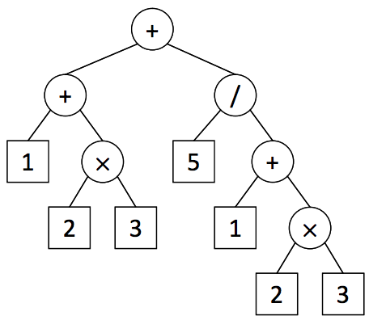
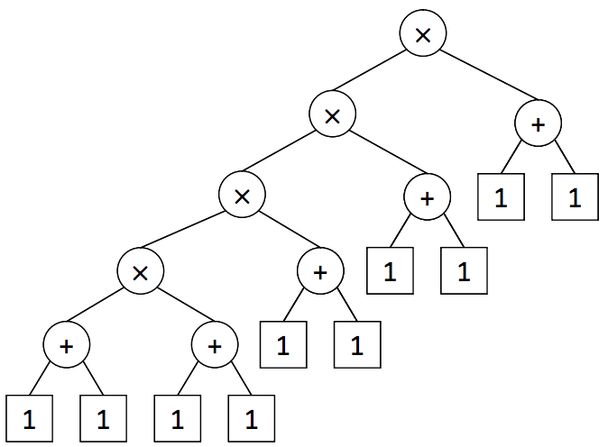

## 문제

Taeyang has to compute a very complex expression using his calculator. He wants to use the memory facility in the calculator, but there is only one memory cell since his calculator is a quite old model. However, he wants to maximize the usability of the single memory cell by finding the largest common subexpression for a given input expression.

For example, look at the following input expression,

1 + (2 × 3) + 5 / (1 + 2 × 3).

This expression has two occurrences of 2 × 3, so it is a common subexpression. There are another two occurrences of 1 + 2 × 3. Thus this expression has two common subexpressions, 2 × 3 and 1 + 2 × 3. The largest (or longest) common subexpression is 1 + 2 × 3. Note that the first pair of parentheses (2 × 3) in the input expression is superfluous since 1 + (2 × 3) is same as 1 + 2 × 3 by the precedence between operators. Taeyang wants to find a largest common subexpression and to store the result of it into the single memory cell. You write a program to help Taeyang to find the largest common subexpression for a given expression.

To simplify the problem, the only four types of binary operators are considered, i.e. the addition (+), the subtraction (−), the multiplication (×), and the division (/). The usual precedence rules (the multiplication and the division have higher precedence over the addition and the subtraction) are applied and all the operators are assumed left-associative. Hence, the expression tree for the above expression can be depicted as in Figure 1.

Figure 1. The expression tree for 1 + (2 × 3) + 5 / (1 + 2 × 3).

When you construct the expression tree, you should apply the precedence and the associativity of operators (Rule 1), and also preserve the order of operands in the input expression, i.e., the order in the expression must be the same as that of in-order traversal in the tree (Rule 2). The expression tree is an ordered, single-rooted tree; a subexpression corresponds to a unique subtree of the expression tree whose leaf nodes represent the operands in the same order occurred in the expression. Thus a common subexpression exists if there are two  disjoint, identical subtrees in the expression tree. Finally, the common subexpression should not be overlapped (Rule 3). Even though Rule 3 is a natural consequence of Rule 1, this rule is specified for clarity.

The size of an expression is the number of operators and operands included in the expression, which corresponds to the number of nodes of the expression tree. Therefore, the parentheses for clarifying the bindings between operators and the operands are not counted for the size. For instance, the size of the expression (50 + 50) × ((2) + 3) is seven even though it contains many pairs of parentheses. Note that the common subexpression should be proper, i.e. the size of it is less than that of the whole expression. As a result, finding a largest common expression in a given expression is equivalent to finding two disjoint same subtrees in the corresponding expression tree satisfying Rule 1, 2, and 3 with the maximum size.

Let us consider, for example, an expression (1 + 1) × (1 + 1) × (1 + 1) × (1 + 1) × (1 + 1) . For this expression, you may think a largest common subexpression is (1 + 1) × (1 + 1) × (1 + 1) × (1 + 1), but its two occurrences overlap each other, so this violates Rule 3. You also think a common subexpression would be (1 + 1) × (1 + 1), but it is not because there are no two disjoint same subtrees corresponding to two disjoint occurrences of (1 + 1) × (1 + 1) in the expression tree in Figure 2. Actually 1 + 1 is a unique common subexpression in the given expression, so it is the largest.

Figure 2. The expression tree for (1 + 1) × (1 + 1) × (1 + 1) × (1 + 1) × (1 + 1).

As a final example, the common subexpression of (1 + 2 × 3) + 5 / (2 × 3 + 1) should be 2 × 3 instead of 1 + 2 × 3 or 2 × 3 + 1 because the order of the operands are different, which violates Rule 2.

## 입력

Your program is to read from standard input. The input consists of a single line containing the input expression. It consists of the operands (positive integers), the binary operators (`+`, `-`, `*`, `/`), and parentheses. The maximum length of the input line is 1,000 including the newline character. For the multiplication, the symbol `*` is used instead of `×`. The operators, the operands, and the parentheses can be separated by zero or more white spaces. Assume that the input expression contains at least one common subexpression and also assume that the size of it should be greater than or equal to three.

## 출력

Your program is to write to standard output. Print the postfix for the largest common subexpression in a single line. The postfix of an expression is the result of the post-order traversal of the expression tree. For instance, the postfix of the expression `1 + 2 * 3` is `1 2 3 * +`. In the output, the operators and the operands should be separated by a space. If there exist different largest common subexpressions, print arbitrary one of them. If your input is an invalid expression, your program should print `ERROR`.
