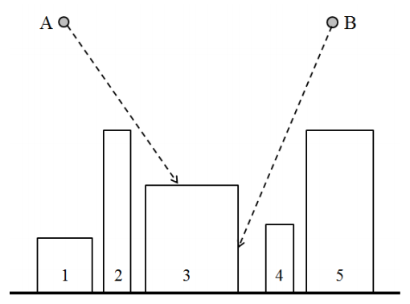

## 문제

NSC(Naro Space Center) has observed that k meteorites are falling to our city. NSC wants to know which buildings in the city will be collided with the falling meteorites.

They are considering this problem in 2-dimensional version first. There are n buildings in the city. All buildings are represented by rectangles whose bottom sides are located on the x-axis. All rectangles are disjoint, i.e., any two distinct rectangles do not intersect each other. Let’s distinguish the rectangles by the integers from 1 to n. The rectangle 1 is the leftmost rectangle. The rectangle i lies on the left of the rectangle j if 1 ≤ i < j ≤ n (See the figure below).

All meteorites are represented by points. Every meteorite is falling along a line whose slope is represented by a pair of integers (dx, dy). If a meteorite is currently located on (x, y) and its slope is (dx, dy), it is falling along the line connecting two points (x, y) and (x + dx, y + dy). In the above figure, we can see that both of the meteorites A and B are rushing toward the building 3. If a meteorite touches a point of the boundary of a building, it will be immediately perished by explosion.

Given a data set of n buildings and k meteorites, write a program to compute which building will be damaged for each meteorite.

## 입력

Your program is to read from standard input. The input starts with a line containing an integer, n (1 ≤ n ≤ 100,000), where n is the number of rectangles representing the buildings in the city. In the following n lines, each of n rectangles is given line by line in left-to-right order. All rectangles are numbered from 1 to n in order given as the input. Each rectangle is represented by three integers, x1, x2, and h (1 ≤ x1 < x2 ≤ 109, 1 ≤ h < 109), where x1 and x2 are the x–coordinates of the left side and the right side of the rectangle, respectively, and h is the y–coordinate of the top side of it. Note that the bottom sides of all rectangles are located on the x–axis and the rectangle i lies on the left of the rectangle j if 1 ≤ i < j ≤ n. The next line contains an integer, k (1 ≤ k ≤ 100,000) which represents the number of meteorites. In the following k lines, each of k meteorites is given line by line. Each meteorite is represented by four integers, x, y, dx, and dy (1 ≤ x ≤ 109, max{h} < y ≤ 109, −1,000 ≤ dx ≤ 1,000, −1,000 ≤ dy ≤ −1), where (x, y) is the current coordinate of the meteorite, (dx, dy) represents a slope of the line along which the meteorite is falling, and max{h} is the highest value among the y–coordinates of the top sides of the buildings.

## 출력

Your program is to write to standard output. Print exactly one line for each meteorite in order given as the input. The line should contain the building number which will be collided with a meteorite. If no building will be damaged, print the zero(0).
