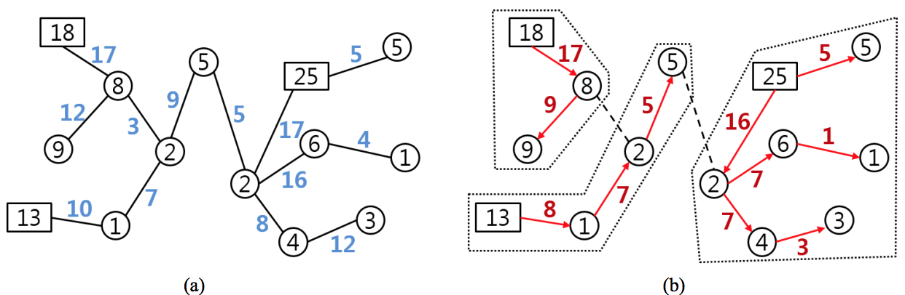

## 문제

There is a tree T with N vertices, as a power delivery network. Each vertex of T is either a supply vertex or a demand vertex, which has a positive integer called the supply or demand, respectively. Each demand vertex can receive power from exactly one supply vertex through edges in T. That brings up a flow of power through edges. Each edge is assigned a positive integer called the capacity.

One wishes to partition T into subtrees by deleting edges from T, if necessary. Of course, T itself can be a partition. But the followings should be satisfied:

1. Each subtree contains exactly one supply vertex whose supply is no less than the sum of all demands in the subtree.
2. The flow of power through each edge is no more than the capacity of the edge.

Your program should answer to the question of whether T has such a partition.

For example, Figure 1(a) depicts a tree T: each supply vertex is drawn by a rectangle, each demand vertex by a circle, the supply or demand is written inside, and the capacity is attached to each edge. The tree T has a desired partition as illustrated in Figure 1(b): the deleted edges are drawn by dashed lines and each subtree is surrounded by a dotted line: the flow value is attached to each edge and the flow direction is indicated by an arrow.

Figure 1. Illustration of a partition.

## 입력

Your program is to read from standard input. The first line of the input contains one integer N to represent the number of vertices in the tree T (1 ≤ N ≤ 300,000). The vertices are represented by integers 1, 2, …, N. The i-th line of the next N lines contains two integers a and b, where if a = 0, then the vertex i is a supply vertex with the supply b, and if a = 1, then the vertex i is a demand vertex with the demand b (i = 1, … , N, a = 0 or 1, and 1 ≤ b ≤ 109). Also each of the next N − 1 lines contains three integers x, y, and z to represent one edge in T, joining two vertices x, y with the capacity z (1 ≤ x, y ≤ N, 1 ≤ z ≤ 109).

## 출력

Your program is to write to standard output. Print either 0 or 1 in the line. If there is a desired partition from T, then print 1. Otherwise, print 0.
