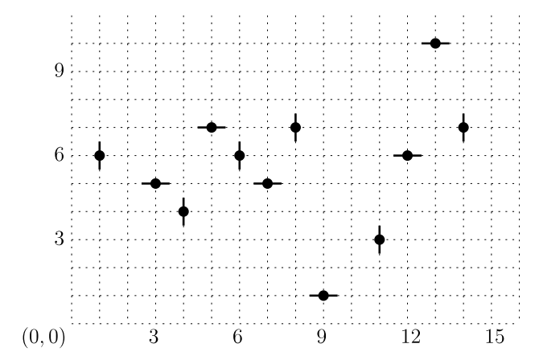
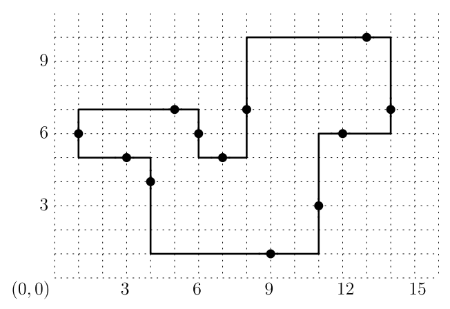

## 문제

A simple polygon in the plane is called monotone if every vertical line intersects the interior of the polygon in at most one line segment, and is called orthogonal if every edge of the polygon is either horizontal or vertical. Since many actual room layouts in floor plans are orthogonal and monotone, it is natural to represent them by orthogonal and monotone polygons in the plane.

We consider the following problem of reconstructing a polygon from a set of data points obtained from an orthogonal and monotone room layout. The interior of the room layout is connected. There is exactly one data point for each edge of the room layout and it lies in the interior of the edge. Each data point consists of its position (the x-coordinate and the y-coordinate) and the orientation of the edge (H for a horizontal edge and V for a vertical edge) where it lies. Your program is to compute the length of the boundary of the orthogonal and monotone polygon that can be reconstructed from input set of data points.

Figure 1. 12 data points in the plane: (9, 1, H), (3, 5, H), (6, 6, V), (5, 7, H), (14, 7, V), (11, 3, V), (7, 5, H), (13, 10, H), (12, 6, H), (1, 6, V), (4, 4, V), (8, 7, V).

For example, consider an input consisting of the following 12 data points as shown in Figure 1. Each data point is shown as a point with a short segment specifying the orientation of the edge where the point lies. Then, one can reconstruct an orthogonal and monotone polygon from the data points as shown in Figure 2. Note that there is no other polygon that can be reconstructed from the data points.

Figure 2. An orthogonal and monotone polygon reconstructed from the data points in Figure 1.

The polygon shown in Figure 2 has edges of lengths 2, 5, 2, 2, 5, 6, 4, 3, 5, 7, 4, 3, in clockwise order along the boundary from the leftmost vertical edge. Therefore, if these 12 data points of Figure 1 are given as input of your program, then your program must output 48 as the answer.

Your program is to compute the length of the boundary of the orthogonal and monotone polygon that can be reconstructed from an input set of data points.

## 입력

Your program is to read from standard input. The first line contains an integer, n (4 ≤ n ≤ 500,000), where n is the number of data points. In the following n lines, the data points are given one by one. Each line contains two integers that are the x-coordinate and the y-coordinate of a data point followed by an indicator of 0 or 1. Each integer is between −230 and 230 − 1, inclusively. The indicator is 0 if the edge where the data point lies is horizontal, and 1 otherwise.

## 출력

Your program is to write to standard output. Print the length of the boundary of an orthogonal and monotone polygon that is reconstructed from the input. If there is no orthogonal and monotone polygon that can be reconstructed from input, print -1.
