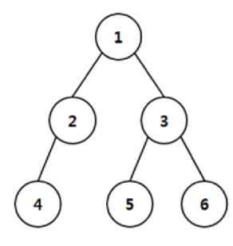

## 문제

A malicious computer virus is to spread through a tree network. The network forms a binary tree and the infection or protection of nodes will be done as in the following process:

1. At time 0, the virus infects the root.
2. At each subsequent time step, only a single uninfected node can be protected by a computer vaccine. Also, at each subsequent time step, the virus spreads from infected nodes to all their unprotected child nodes. Once infected or protected, a node remains so during the whole process.
3. When the virus can be no longer spread, the process ends.

In this problem, we would like to minimize the number of infected nodes when the process ends. For example, consider the network in Figure 1.

Figure 1. Illustration of a computer network.

At time 0, the virus infects the root of network, node 1. At time 1, suppose node 3 is protected, then the virus infects node 2. Subsequently, suppose node 4 is protected at time 2, then the virus can be no longer spread. When the process ends, the number of infected nodes is 2. If node 2 is protected instead of node 3 at time 1, the virus infects node 3 and the number of infected nodes cannot be smaller than 2. So, the minimum possible number of infected nodes is 2 in this example.

Given a network of binary tree, you are to write a program that computes the minimum possible number of infected nodes.

## 입력

Your program is to read from standard input. The input starts with a line containing a positive integer n (1 ≤ n < 220) which represents the number of nodes in the network. Then follow n lines; the i-th line describes the node i with two integers representing the left child and the right child of the node. It is assumed that nodes are numbered from 1 to n. The root of network is node 1, and an empty node is represented by 0.

## 출력

Your program is to write to standard output. Print exactly one line which contains the minimum possible number of infected nodes.
