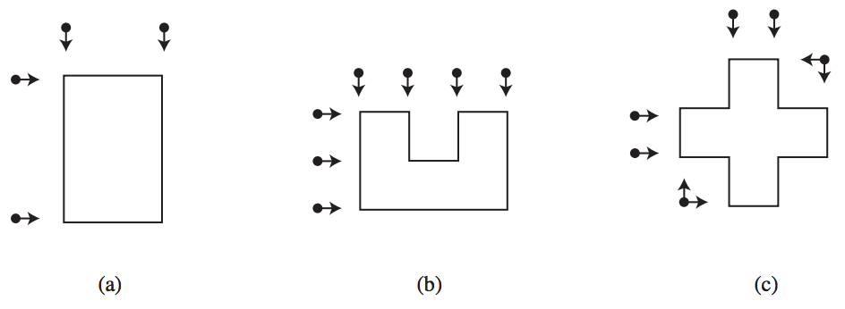

## 문제

Assim como na Terra, o vôlei é um esporte muito popular em Marte; as regras lá são as mesmas do vôlei terrestre -- os times não devem deixar a bola tocar na sua metade da quadra -- mas há uma importante diferença: ao contrário do vôlei terrestre, lá as quadras não são necessariamente retangulares; elas podem ser polígonos quaisquer, desde que seus lados sejam paralelos aos eixos coordenados.

Assim como no vôlei terrestre, os lances polêmicos são aqueles em que a bola cai muito próxima à linha da quadra. Para evitar discussões, todos os jogos de vôlei marciano são acom- panhados por juízes de linha. A função deles é observar a bola quando ela cai próxima a uma das linhas e dizer se ela caiu dentro ou fora da quadra.

Quando um juiz está alinhado com várias linhas da quadra, ele pode observar todas elas ao mesmo tempo (no conjunto de linhas sob responsabilidade de um mesmo juiz pode haver até linhas perpendiculares entre si). No entanto, para evitar acidentes, a Federação Intergaláctica de Vôlei Marciano decretou as seguintes normas de segurança:

* os juízes devem ficar parados durante o jogo;
* os juízes não podem ficar dentro da quadra, nem mesmo sobre a sua linha.

A figura abaixo ilustra três formatos de quadras possíveis, mostrando uma alocação mínima de juízes para cada uma delas; a quadra (a) necessita de quatro juízes, a quadra (b) necessita de sete juízes, e a quadra (c) necessita de seis juízes.

Você deve escrever um programa que, dado o formato da quadra, determina o número mínimo de juízes de linha necessários para que todas as linhas da quadra sejam acompanhadas por pelo menos um juiz.

## 입력

A entrada contém vários casos de teste. A primeira linha de um caso de teste contém um inteiro par N, que indica o número de lados da quadra de vôlei (4 ≤ N ≤ 100). Cada uma das N linhas seguintes contém dois números inteiros Xi e Yi, representando as coordenadas de um dos vértices da quadra (-1.000.000.000 ≤ Xi, Yi ≤ 1.000.000.000). As coordenadas são dadas em ordem, de modo que (Xi, Yi) forma um lado da quadra com (Xi+1, Yi+1), para 1 ≤ i < N , e (XN, YN) forma um lado com (X1, Y1). Lados consecutivos da quadra são sempre perpendiculares, e o polígono descrito na entrada é sempre um polígono simples.

O final da entrada é indicado por N = 0.

## 출력

Para cada caso de teste da entrada seu programa deve produzir uma única linha na saída, contendo um número inteiro, indicando o menor número de juízes de linha necessários.
