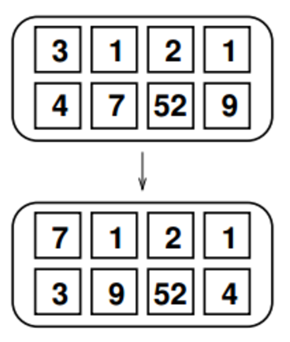

## 문제

O SBC–Sistema de Balanceamento de Containers precisa ser atualizado para funcionar com uma nova classe de navios, a “dois por quatro”, que são navios que podem carregar oito grandes containers numa disposição de duas linhas e quatro colunas, como mostrado na figura ao lado. Esses navios possuem um guindaste fixo que é capaz de realizar um único tipo de movimentação: levantar dois containers adjacentes, na linha ou na coluna, e trocá-los de posição. Para acelerar o carregamento nos portos, os oito containers são embarcados em qualquer uma das oito posições, definindo uma configuração inicial. Depois que o navio deixa o porto, o guindaste precisa mover os containers para deixá-los numa configuração final pré-definida para a viagem.

O problema é que o custo de combustível para o guindaste realizar uma movimentação é igual à soma dos pesos dos dois containers adjacentes cujas posições foram trocadas. Dados os pesos dos containers em cada posição nas configurações inicial e final, o SBC precisa computar o custo total mínimo possível de uma sequência de movimentações que leve os containers da configuração inicial à configuração final.

## 입력

A entrada consiste de quatro linhas contendo, cada uma, quatro inteiros entre 1 e 1000, inclusive. As duas primeiras linhas definem os pesos na configuração inicial e as duas últimas linhas, os pesos na configuração. Sempre existe uma solução, pois os containers nas configurações inicial e final são os mesmos, com as posições possivelmente trocadas.

## 출력

Seu programa deve produzir uma única linha contendo um inteiro, representando o custo total mínimo de uma sequência de movimentos que leve da configuração inicial à configuração final.
