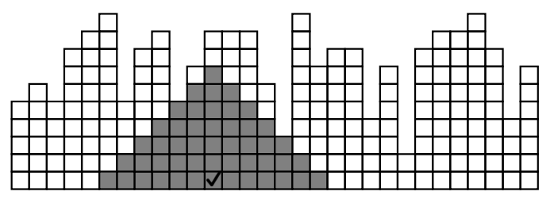
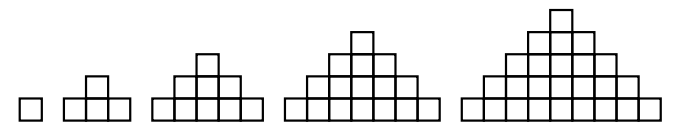

## 문제

Os irmãos Sérgio e Luiz estavam brincando com cubinhos de madeira e queriam construir um muro, que acabou ficando incompleto, com as colunas tendo diferentes alturas, como nessa figura.

Eles decidiram agora que a brincadeira seria retirar cubinhos, sempre de cima para baixo nas colunas, de maneira que no final restasse apenas um triângulo isósceles de cubinhos. Eles podem apenas retirar cubinhos do muro, sem recolocar em outra coluna, e os triângulos têm que ser completos. A figura abaixo ilustra os cinco primeiros triângulos isósceles de cubinhos, do tipo que eles querem, com alturas 1, 2, 3, 4 e 5 respectivamente.

Dada a sequência de alturas das colunas do muro, seu programa deve ajudar Sérgio e Luiz a descobrir qual é a altura máxima que o triângulo poderia ter ao final. No muro da primeira figura, com 30 colunas de cubinhos, o triângulo mais alto possível teria altura igual a sete.

## 입력

A primeira linha da entrada contém um inteiro N, representando o número de colunas do muro. A segunda linha contém N inteiros Ai, indicando as alturas de cada coluna.

Restrições

* 1 ≤ N ≤ 50000
* 1 ≤ Ai ≤ N

## 출력

Seu programa deve produzir uma única linha com um inteiro H, representando a altura máxima que um triângulo poderia ter ao final.
