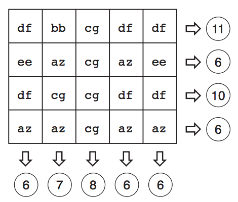

## 문제

Discussões recentes na Internet causaram uma onda de renovado interesse em quebra-cabeças de lógica. Neste problema a sua tarefa é escrever um programa que resolva quebra-cabeças como o mostrado na figura abaixo, muito comum em revistas de desafios lógicos. Nesse quebra-cabeças, as letras dentro do quadriculado representam variáveis, e os números representam as somas dos valores das variáveis em cada linha ou coluna.

O objetivo desse tipo de quebra-cabeça é determinar o valor de cada variável de modo a satisfazer as somas das linhas e colunas mostradas. Mas como esse tipo de quebra-cabeças é para crianças, ele tem uma propriedade que o torna mais fácil de encontrar a solução: sempre é possível encontrar uma linha ou coluna em que há apenas uma variável cujo valor ainda é desconhecido. Assim, uma possível maneira de resolver o problema é, a cada passo da solução, encontrar o valor de uma variável.

Dado um quebra-cabeça, você deve determinar os valores das variáveis que o solucionam.

## 입력

A primeira linha contém dois inteiros L (1 ≤ L ≤ 100) e C (1 ≤ C ≤ 100) indicando o número de linhas e o número de colunas do quebra-cabeça. Cada uma das L linhas seguintes contém C nomes de variáveis, seguidos de um inteiro S, a soma resultante das variáveis dessa linha (−108 ≤ S ≤ 108). A última linha contém C inteiros Xi (−108 ≤ Xi ≤ 108), indicando respectivamente a soma das variáveis na coluna i. Nomes de variáveis são formados por precisamente duas letras minúsculas, de ’a’ a ’z’. Todos os quebra-cabeças têm solução única, em que todas as variáveis são números inteiros entre −106 and 106.

## 출력

Seu programa deve produzir uma linha para cada variável do quebra-cabeças, contendo o nome da variável e o seu valor inteiro. As variáveis devem ser escritas em ordem alfabética crescente, ou seja,respeitando a ordem

aa, ab, . . . , az, ba, bb, . . . , za, zb, . . . , zz.
