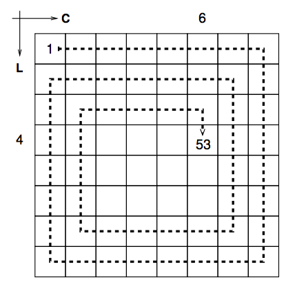

## 문제

Dado um tabuleiro de dimensões N × N, gostaríamos de colocar feijões, um grão em cada quadrado, seguindo uma espiral como mostrado na figura. Começando do canto superior esquerdo, com coordenadas (1, 1), e depois indo para a direita enquanto possível, depois para baixo enquanto possível, depois para esquerda enquanto possível e depois para cima enquanto possível. Repetimos esse padrão, direita-baixo-esquerda-cima, até que B grãos de feijão sejam colocados no tabuleiro. O problema é: dados N e B, em que coordenadas será colocado o último grão de feijão? Na figura, para N = 8 e B = 53, o último grão foi colocado no quadrado de coordenadas (4, 6).

## 입력

A entrada contém apenas uma linha com dois inteiros, N e B, onde 1 ≤ N ≤ 230 e 1 ≤ B ≤ N2 .

## 출력

Seu programa deve produzir uma única linha com dois inteiros L e C representando as coordenadas do último grão de feijão.
