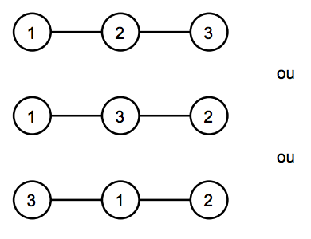

## 문제

Oa é um dos mundos mais antigos do universo DC, é lá que habitam os guardiões do universo. Eles administram a tropa dos lanternas verdes, uma das maiores forças do universo! Todos sabem que os lanternas verdes sabem voar devido ao poder do anel, porém nem todos os habitantes de Oa fazem parte da tropa. Para esses habitantes está difícil se locomover entre as cidades, pois não há estradas!

Os guardiões desejam conectar as cidades de Oa construindo algumas estradas. Existem N cidades em Oa, e eles desejam construir N−1 estradas de duas mãos, de tal forma que seja possível chegar de uma cidade até qualquer outra, direta ou indiretamente. Os guardiões também não desejam privilegiar demais nenhuma cidade, por isso eles estabeleceram que nenhuma cidade pode ter mais de K estradas. Por exemplo, se temos três cidades e K vale 2, temos as três opções:

Os guardiões, porém, são muito curiosos, e perguntaram aos lanternas verdes se eles eram capazes de dizer de quantas formas é possível construir N−1 estradas obedecendo estas restrições. Sua tarefa, como membro da tropa dos lanternas verdes é, dados N e K, satisfazer a curiosidade dos guardiões.

## 입력

A entrada consiste de uma única linha que contém dois números inteiros N (1 ≤ N ≤ 102) e K (1 ≤ K ≤ N).

## 출력

Seu programa deve produzir uma única linha, contendo um único número inteiro, a resposta do problema. Como essa resposta pode ser muito grande, imprima-a módulo 109 + 7.
